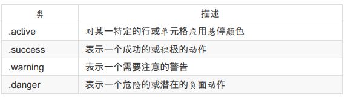

##Bootstrap
######简介
- 什么是bootstrap
 - Bootstrap 是一个用于快速开发 Web 应用程序和网站的前端框架。 Bootstrap 是基于 HTML、 CSS、 JAVASCRIPT 的。

- 历史

 - Bootstrap 是由 Twitter 的 Mark Otto 和 Jacob Thornton 开发的。 Bootstrap 是2011 年八月在 GitHub 上发布的开源产品。

- 为什么使用bootstrap

 - 移动设备优先：自 Bootstrap 3 起， 框架包含了贯穿于整个库的移动设备优先的样式。
 - 浏览器支持：所有的主流浏览器都支持 Bootstrap
 - 容易上手：只要您具备 HTML 和 CSS 的基础知识， 您就可以开始学习Bootstra
 - 响应式设计：Bootstrap 的响应式 CSS 能够自适应于台式机、 平板电脑和手机。
 - 它为开发人员创建接口提供了一个简洁统一的解决方案
 - 它包含了功能强大的内置组件， 易于定制
 - 它还提供了基于 Web 的定制
 - 它是开源的

- bootstrap包的内容

 - 基本结构：Bootstrap 提供了一个带有网格系统、 链接样式、 背景的基本结构。
 - CSS：Bootstrap 自带以下特性：全局的 CSS 设置、 定义基本的 HTML 元素样式、 可扩展的 class， 以及一个先进的网格系统。
 - 组件：Bootstrap 包含了十几个可重用的组件， 用于创建图像、 下拉菜单、 导航、 警告框、 弹出框等等。 
 - JavaScript 插件：Bootstrap 包含了十几个自定义的 jQuery 插件。 您可以直接包含所有的插件， 也可以逐个包含这些插件。 
 - 定制：您可以定制 Bootstrap 的组件、 LESS 变量和 jQuery 插件来得到您自己的版本。

- Bootstrap CDN推荐
 - 百度的静态资源库(`http://cdn.code.baidu.com/`)上的Bootstrap资源。
 - 百度的静态资源库的 CDN 服务， 访问速度更快、 加速效果更明显、 没有速度和带宽限制、 永久免费！


######Bootstrap CSS 概览
- html5文档类型(Doctype)

 - Bootstrap 使用了一些 HTML5 元素和 CSS 属性。 为了让这些正常工作， 您需要使用 HTML5 文档类型（ Doctype） 。 因此， 请在使用 Bootstrap 项目的开头包含下面的代码段。

    ```bash
	<!DOCTYPE html>
	<html>
	....
	</html>
	```

- 为了让 Bootstrap 开发的网站对移动设备友好， 确保适当的绘制和触屏缩放， 需要在网页的 head 之中添加 viewport meta 标签， 如下所示：

  ```bash
  <meta name="viewport" content="width=device-width, initial-scale=1.0">
  ```

 - `initial-scale=1.0`确保网页加载时， 以 1:1 的比例呈现， 不会有任何的缩放。
 - 在移动设备浏览器上， 通过为 viewport meta 标签添加 user-scalable=no 可以禁用其缩放（ zooming） 功能。
 - 通常情况下， maximum-scale=1.0 与 user-scalable=no 一起使用。 这样禁用缩放功能后， 用户只能滚动屏幕， 就能让您的网站看上去更像原生应用的感觉。
 - **注意， 这种方式我们并不推荐所有网站使用， 还是要看您自己的情况而定！**

    ```bash
	<meta name="viewport" content="width=device-width, initial-scale=1.0, maximum-scale=1.0, user-scalable=no">
	```

######响应式图像
- ``
- 通过添加 img-responsive class 可以让 Bootstrap 3 中的图像对响应式布局的支持更友好。

######全局显示、 排版和链接
- Bootstrap 3 使用 body {margin: 0;} 来移除 body 的边距。
- 排版

 - 使用 @font-family-base、 @font-size-base 和 @line-height-base 属性作为排版样式。

- 链接样式

 - 通过属性 @link-color 设置全局链接的颜色


- 避免跨浏览器的不一致

 - Bootstrap 使用 Normalize 来建立跨浏览器的一致性。
 - Normalize.css 是一个很小的 CSS 文件， 在 HTML 元素的默认样式中提供了更好的跨浏览器一致性。

######容器
```bash
<div class="container">
...
</div>
```

- Bootstrap 3 的 container class 用于包裹页面上的内容。

- 请注意， 由于内边距（ padding） 是固定宽度， 默认情况下容器是不可嵌套的。


######Bootstrap 网格系统(Grid System)
- Bootstrap 提供了一套响应式、 移动设备优先的流式网格系统， 随着屏幕或视口（ viewport） 尺寸的增加， 系统会自动分为最多12列。

 

- 工作原理：

 - 行必须放置在 .container class 内， 以便获得适当的对齐（ alignment） 和内边距（ padding） 。
 - 使用行来创建列的水平组。
 - 内容应该放置在列内， 且唯有列可以是行的直接子元素。
 - 预定义的网格类， 比如 .row 和 .col-xs-4， 可用于快速创建网格布局。 LESS混合类可用于更多语义布局。
 - 列通过内边距（ padding） 来创建列内容之间的间隙。 该内边距是通过 .rows上的外边距（ margin） 取负， 表示第一列和最后一列的行偏移。
 - 网格系统是通过指定您想要横跨的十二个可用的列来创建的。 例如， 要创建三个相等的列， 则使用三个 .col-xs-4。

- 媒体查询

 ```bash
 /* 超小设备（ 手机， 小于 768px） */
/* Bootstrap 中默认情况下没有媒体查询 */
/* 小型设备（ 平板电脑， 768px 起） */
@media (min-width: @screen-sm-min) { ... }
/* 中型设备（ 台式电脑， 992px 起） */
@media (min-width: @screen-md-min) { ... }
/* 大型设备（ 大台式电脑， 1200px 起） */
@media (min-width: @screen-lg-min) { ... }
 ```

- 有时候也会在媒体查询代码中包含 max-width， 从而将 CSS 的影响限制在更小范围的屏幕大小之内。

 `@media (min-width: @screen-sm-min) and (max-width: @screen-sm-max)`

######Bootstrap 排版
- Bootstrap 使用 Helvetica Neue、 Helvetica、 Arial 和 sans-serif 作为其默认的字体栈。
- 使用 Bootstrap 的排版特性， 您可以创建标题、 段落、 列表及其他内联元素。

- 内联子标题

 - 如果需要向任何标题添加一个内联子标题， 只需要简单地在元素两旁添加`<small>`

- 引导主体副本

 - 为了给段落添加强调文本， 则可以添加 class="lead"， 这将得到更大更粗、 行高更高的文本


- 缩写

 - HTML `<abbr>`元素提供了用于缩写的标记， 比如 WWW 或 HTTP。 Bootstrap 定义`<abbr>` 元素的样式为显示在文本底部的一条虚线边框， 当鼠标悬停在上面时会显示完整的文本（ 只要您为 `<abbr>` title 属性添加了文本） 。 为了得到一个更小字体的文本， 请添加 .initialism 到 `<abbr> </abbr>`

 `<abbr title="Real Simple Syndication" class="initialism">RSS</abbr>`

- 地址（ Address）
- 引用（ Blockquote）
- 列表

 - Bootstrap 支持有序列表、 无序列表和定义列表。


######Bootstrap 代码
- Bootstrap 允许您以两种方式显示代码：

 - 第一种是 `<code>` 标签。 如果您想要内联显示代码， 那么您应该使用 `<code>`标签。
 - 第二种是 `<pre>` 标签。 如果代码需要被显示为一个独立的块元素或者代码有多行， 那么您应该使用 `<pre>` 标签。


######Bootstrap 表格
- 如果您想要一个只带有内边距（ padding） 和水平分割的基本表， 请添加 class.table

- 条纹表格

 - 通过添加 .table-striped class， 您将在 `<tbody>` 内的行上看到条纹

- 边框表格

 - 通过添加 .table-bordered class， 您将看到每个元素周围都有边框， 且占整个表格是圆角的

- 悬停表格

 - 通过添加 .table-hover class， 当指针悬停在行上时会出现浅灰色背景


- 精简表格

 - 通过添加 .table-condensed class， 行内边距（ padding） 被切为两半， 以便让表看起来更紧凑

- 上下文类

 - 下表中所列出的上下文类允许您改变表格行或单个单元格的背景颜色。

    

 - 这些类可被应用到 `<tr>`、 `<td>` 或 `<th>`。

- 响应式表格

 - 通过把任意的 .table 包在 .table-responsive class 内， 您可以让表格水平滚动以适应小型设备（ 小于 768px） 。 当在大于 768px 宽的大型设备上查看时， 您将看不到任何的差别。

######Bootstrap 表单
Bootstrap 通过一些简单的HTML 标记和扩展的类即可创建出不同样式的表单。

- Bootstrap 提供了下列类型的表单布局：

 - 垂直表单（ 默认）
 - 内联表单
 - 水平表单

- 向父`<form>`元素添加 role="form"
- 把标签和控件放在一个带有 class .form-group 的 `<div>` 中。 这是获取最佳间距所必需的。
- 向所有的文本元素 `<input>`、 `<textarea>` 和 `<select>` 添加 class .formcontrol。

- 内联表单

 - 如果需要创建一个表单， 它的所有元素是内联的， 向左对齐的， 标签是并排的， 请向` <form> `标签添加 class .form-inline

- 水平表单

 - 水平表单与其他表单不仅标记的数量上不同， 而且表单的呈现形式也不同。
 - 向父 `<form>` 元素添加 class .form-horizontal
 - 把标签和控件放在一个带有 class .form-group 的` <div> `中
 - 向标签添加 class .control-label

- 支持的表单控件

 - Bootstrap 支持最常见的表单控件， 主要是 input、 textarea、 checkbox、 radio 和select。

- 静态控件

 - 当您需要在一个水平表单内的表单标签后放置纯文本时， 请在 `<p>` 上使用 class.form-control-static。

- 表单控件状态

 - 除了 :focus 状态（ 即， 用户点击 input 或使用 tab 键聚焦到 input 上） ， Bootstrap还为禁用的输入框定义了样式， 并提供了表单验证的 class。

 - 验证状态
   - Bootstrap 包含了错误、 警告和成功消息的验证样式。 只需要对父元素简单地添加适当的 class（ .has-warning、 .has-error 或 .has-success） 即可使用验证状态。

- 表单控件大小
 - 您可以分别使用 class .input-lg 和 .col-lg-* 来设置表单的高度和宽度。 下面的实例演示了这点：

- 表单帮助文本

 - Bootstrap 表单控件可以在输入框 input 上有一个块级帮助文本。 为了添加一个占用整个宽度的内容块， 请在 `<input>` 后使用 .help-block。 下面的实例演示了这点：


######Bootstrap 按钮
- 任何带有 class .btn 的元素都会继承圆角灰色按钮的默认外观。 但是 Bootstrap 提供了一些选项来定义按钮的样式，具体如下表所示：

  

- 还可以设置按钮大小
 

- 按钮状态
 
 

- 按钮标签

 - 可以在 `<a>`、 `<button>` 或 `<input>` 元素上使用按钮 class。 但是建议您在`<button>` 元素上使用按钮 class， 避免跨浏览器的不一致性问题。


######Bootstrap 图像
-  Bootstrap 提供了三个可对图像应用简单样式的 class：

 - .img-rounded：添加 border-radius:6px 来获得图像圆角。
 - .img-circle：添加 border-radius:500px 来让整个图像变成圆形。
 - .img-thumbnail：添加一些内边距（ padding） 和一个灰色的边框。


######Bootstrap 响应式实用工具


######Bootstrap 字形图标（ Glyphicons）
Bootstrap捆绑了 200 多种字体格式的字形
- 用法

 - 如需使用图标， 只需要简单地使用下面的代码即可。 请在图标和文本之间保留适当的空间。

 `<span class="glyphicon glyphicon-search"></span>`

######Bootstrap 下拉菜单（ Dropdowns）
- 下拉菜单是可切换的， 是以列表格式显示链接的上下文菜单。 这可以通过与 下拉菜单（ Dropdown） JavaScript 插件 的互动来实现。
- 如需使用下列菜单， 只需要在 class .dropdown 内加上下拉菜单即可。
- 对齐

 - 通过向 .dropdown-menu 添加 class .pull-right 来向右对齐下拉菜单

- 标题

 - 可以使用 class dropdown-header 向下拉菜单的标签区域添加标题

######Bootstrap 按钮组
- 按钮组允许多个按钮被堆叠在同一行上。 当你想要把按钮对齐在一起时， 这就显得非常有用。 可以通过 Bootstrap 按钮（ Button） 插件 添加可选的 JavaScript 单选框和复选框样式行为。

- .btn-group

 - 该 class 用于形成基本的按钮组。 在 .btn-group 中放置一系列带有 class .btn 的按钮。

- .btn-toolbar

 - 该 class 有助于把几组` <div class="btn-group">` 结合到一个` <div class="btntoolbar">` 中， 一般获得更复杂的组件。

- .btn-group-lg, .btn-group-sm, .btn-group-xs
 - 这些 class 可应用到整个按钮组的大小调整， 而不需要对每个按钮进行大小调整。

- .btn-group-vertical

 - 该 class 让一组按钮垂直堆叠显示， 而不是水平堆叠显示。

- 嵌套

 - 可以在一个按钮组内嵌套另一个按钮组， 即， 在一个 .btn-group 内嵌套另一个.btn-group 。 当您向让下拉菜单与一系列按钮组合使用时， 就会用到这个。

######按钮
- 如需向按钮添加下拉菜单， 只需要简单地在在一个 .btn-group 中放置按钮和下拉菜单即可。 您也可以使用 `<span class="caret"></span> `来指示按钮作为下拉菜单。

- 分割的按钮下拉菜单

 - 分割的按钮下拉菜单使用与下拉菜单按钮大致相同的样式， 但是对下拉菜单添加了原始的功能。 分割按钮的左边是原始的功能， 右边是显示下拉菜单的切换。

- 按钮下拉菜单的大小

 - 可以使用带有各种大小按钮的下拉菜单：.btn-large、 .btn-sm 或 .btn-xs

- 按钮上拉菜单
 - 菜单也可以往上拉伸的， 只需要简单地向父 .btn-group 容器添加 .dropup 即可。

######Bootstrap 输入框组
- 输入框组扩展自 表单控件。使用输入框组， 您可以很容易地向基于文本的输入框添加作为前缀和后缀的文本或按钮。

- 向 .form-control 添加前缀或后缀元素的步骤如下：

 - 把前缀后后缀元素放在一个带有 class .input-group 的 `<div>` 中。
 - 接着， 在相同的 `<div>` 内， 在 class 为 .input-group-addon 的 `<span>` 内放置额外的内容。
 - 把该` <span> `放置在` <input> `元素的前面或者后面。
 
- 输入框组的大小
 - 可以通过向 .input-group 添加相对表单大小的 class（ 比如 .input-group-lg、input-group-sm、 input-group-xs） 来改变输入框组的大小。 输入框中的内容会自动调整大小。

######Bootstrap 导航元素
- Bootstrap 提供的用于定义导航元素的一些选项。 它们使用相同的标记和基类 .nav。 Bootstrap 也提供了一个用于共享标记和状态的帮助器类。 改变修饰的 class， 可以在不同的样式间进行切换。

- 创建一个标签式的导航菜单：

 - 以一个带有 class .nav 的无序列表开始。
 - 添加 class .nav-tabs。

- 胶囊式的导航菜单

 - 如果需要把标签改成胶囊的样式， 只需要使用 class .nav-pills 代替 .nav-tabs 即可

- 垂直的胶囊式导航菜单

 - 可以在使用 class .nav、 .nav-pills 的同时使用 class .nav-stacked， 让胶囊垂直堆叠。

- 两端对齐的导航

 - 可以在屏幕宽度大于 768px 时， 通过在分别使用 .nav、 .nav-tabs 或.nav、 .nav-pills 的同时使用 class .nav-justified， 让标签式或胶囊式导航菜单与父元素等宽。 在更小的屏幕上， 导航链接会堆叠。

- 禁用链接

 - 对每个 .nav class， 如果添加了 .disabled class， 则会创建一个灰色的链接， 同时禁用了该链接的 :hover 状态

- 下拉菜单
 - 向标签添加下拉菜单的步骤如下：
   - 以一个带有 class .nav 的无序列表开始。
   - 添加 class .nav-tabs。
   - 添加带有 .dropdown-menu class 的无序列表。


######Bootstrap 导航栏
- 导航栏是一个很好的功能， 是 Bootstrap 网站的一个突出特点。 导航栏是响应式元组件就， 作为应用程序或网站的导航标题。 导航栏在移动设备的视图中是折叠的，随着可用视口宽度的增加， 导航栏也会水平展开。 在 Bootstrap 导航栏的核心中，导航栏包括了为站点名称和基本的导航定义样式。

- 创建一个默认的导航栏的步骤如下：

 - 创建一个默认的导航栏的步骤如下：
 - 向上面的元素添加 role="navigation"， 有助于增加可访问性。
 - 向 `<div>` 元素添加一个标题 class .navbar-header， 内部包含了带有 classnavbar-brand 的` <a>` 元素。 这会让文本看起来更大一号。
 - 为了向导航栏添加链接， 只需要简单地添加带有 class .nav、 .navbar-nav 的无序列表即可。

- 响应式的导航栏

 - 为了给导航栏添加响应式特性， 您要折叠的内容必须包裹在带有 classes.collapse、 .navbar-collapse 的 `<div>` 中。 折叠起来的导航栏实际上是一个带有class .navbar-toggle 及两个 data- 元素的按钮。 第一个是 data-toggle， 用于告诉JavaScript 需要对按钮做什么， 第二个是 data-target， 指示要切换到哪一个元素。三个带有 class .icon-bar 的` <span> `创建所谓的汉堡按钮。 这些会切换为 .navcollapse `<div> `中的元素。 为了实现以上这些功能， 您必须包含 Bootstrap 折叠（ Collapse） 插件。

- 导航栏中的表单
 - 导航栏中的表单不是使用 Bootstrap 表单 章节中所讲到的默认的 class， 它是使用.navbar-form class。 这确保了表单适当的垂直对齐和在较窄的视口中折叠的行为。 使用对齐方式选项（ 这将在组件对齐方式部分进行详细讲解） 来决定导航栏中的内容放置在哪里。

- 导航栏中的按钮
 - 可以使用 class .navbar-btn 向不在 `<form>` 中的 `<button>` 元素添加按钮， 按钮在导航栏上垂直居中。 .navbar-btn 可被使用在 `<a>` 和 `<input>` 元素上。

- 导航栏中的文本

 - 如果需要在导航中包含文本字符串， 请使用 class .navbar-text。 这通常与 `<p>` 标签一起使用， 确保适当的前导和颜色。 

- 非导航链接

 - 如果您不想在常规的导航栏导航组件内使用标准的链接， 那么请使用 class navbar-link 来为默认的和倒转的导航栏选项添加适当的颜色

- 组件对齐方式

 - 可以使用实用工具 class .navbar-left 或 .navbar-right 向左或向右对齐导航栏中的 导航链接、 表单、 按钮或文本 这些组件。 这两个 class 都会在指定的方向上添加CSS 浮动。

- 固定到顶部

 - Bootstrap 导航栏可以动态定位。 默认情况下， 它是块级元素， 它是基于在 HTML中放置的位置定位的。 通过一些帮助器类， 您可以把它放置在页面的顶部或者底部， 或者您可以让它成为随着页面一起滚动的静态导航栏。
 - 如果您想要让导航栏固定在页面的顶部， 请向 .navbar class 添加 class .navbarfixed-top。 

- 固定到底部

 - 如果您想要让导航栏固定在页面的底部， 请向 .navbar class 添加 class .navbarfixed-bottom。 

- 静态的顶部

 - 如需创建能随着页面一起滚动的导航栏， 请添加 .navbar-static-top class。 该class 不要求向` <body> `添加内边距（ padding） 。

- 倒置的导航栏

 - 为了创建一个带有黑色背景白色文本的倒置的导航栏， 只需要简单地向 .navbar class 添加 .navbar-inverse class 即可


######Bootstrap 面包屑导航（ Breadcrumbs）
- 面包屑导航（ Breadcrumbs） 是一种基于网站层次信息的显示方式。 以博客为例，面包屑导航可以显示发布日期、 类别或标签。 它们表示当前页面在导航层次结构内的位置。
- Bootstrap 中的面包屑导航（ Breadcrumbs） 是一个简单的带有 .breadcrumb class的无序列表。 分隔符会通过 CSS（ bootstrap.min.css） 中下面所示的 class 自动被添加

######Bootstrap 分页
- .pagination,添加该 class 来在页面上显示分页。

- .disabled, .active

 - 可以自定义链接， 通过使用 .disabled 来定义不可点击的链接， 通过使用 .active来指示当前的页面。

- .pagination-lg, .pagination-sm

 - 使用这些 class 来获取不同大小的项。

- 翻页（Pager）
 - 如果您想要创建一个简单的分页链接为用户提供导航， 可通过翻页来实现。 与分页链接一样， 翻页也是无序列表。 默认情况下， 链接是居中显示。 下表列出了Bootstrap 处理翻页的 class。
 - .pager,添加该 class 来获得翻页链接。
 - .previous, .next,使用 class .previous 把链接向左对齐， 使用 .next 把链接向右对齐。


######Bootstrap 标签
- 标签可用于计数、 提示或页面上其他的标记显示。 使用 class .label 来显示标签

- 可以使用修饰的 class label-default、 label-primary、 label-success、 labelinfo、 label-warning、 label-danger 来改变标签的外观

######Bootstrap 徽章（ Badges）
- 徽章与标签相似， 主要的区别在于徽章的边角更加圆滑。

- 徽章（ Badges） 主要用于突出显示新的或未读的项。 如需使用徽章， 只需要把`<span class="badge">` 添加到链接、 Bootstrap 导航等这些元素上即可。

######Bootstrap 超大屏幕（ Jumbotron）
- 该组件可以增加标题的大小， 并为登陆页面内容添加更多的外边距（ margin） 。 使用超大屏幕（ Jumbotron） 的步骤如下：

 - 创建一个带有 class .jumbotron. 的容器 `<div>`。
 - 除了更大的 `<h1>`， 字体粗细 font-weight 被减为 200px。

- 为了获得占用全部宽度且不带圆角的超大屏幕， 请在所有的 .container class 外使用 .jumbotron class

######Bootstrap 页面标题（ Page Header）
- 页面标题（ Page Header） 是个不错的功能， 它会在网页标题四周添加适当的间距。 当一个网页中有多个标题且每个标题之间需要添加一定的间距时， 页面标题这个功能就显得特别有用。 如需使用页面标题（ Page Header） ， 请把您的标题放置在带有 class .page-header 的 `<div>` 中：

######Bootstrap 缩略图
- 大多数站点都需要在网格中布局图像、 视频、 文本等。 Bootstrap 通过缩略图为此提供了一种简便的方式。 使用 Bootstrap 创建缩略图的步骤如下：

 - 大多数站点都需要在网格中布局图像、 视频、 文本等。 Bootstrap 通过缩略图为此提供了一种简便的方式。 使用 Bootstrap 创建缩略图的步骤如下：
 - 这会添加四个像素的内边距（ padding） 和一个灰色的边框。
 - 当鼠标悬停在图像上时， 会动画显示出图像的轮廓。

- 添加自定义的内容

 - 可以向缩略图添加各种 HTML 内容， 比如标题、 段落或按钮。 具体步骤如下：

    - 把带有 class .thumbnail 的 `<a>` 标签改为 `<div>`。
    - 在该 `<div>` 内， 您可以添加任何您想要添加的东西。 由于这是一个 `<div>`， 我们可以使用默认的基于 span 的命名规则来调整大小。
    - 如果您想要给多个图像进行分组， 请把它们放置在一个无序列表中， 且每个列表项向左浮动。

######Bootstrap 警告（Alerts）
- 警告（ Alerts） 向用户提供了一种定义消息样式的方式。 它们为典型的用户操作提供了上下文信息反馈。

- 可以为警告框添加一个可选的关闭按钮。 为了创建一个内联的可取消的警告框，请使用 警告（ Alerts） jQuery 插件。

- 可以通过创建一个` <div>`， 并向其添加一个 .alert class 和四个上下文 class（ 即.alert-success、 .alert-info、 .alert-warning、 .alert-danger） 之一， 来添加一个基本的警告框。 


######Bootstrap 进度条
Bootstrap 进度条使用 CSS3 过渡和动画来获得该效果。
- 创建一个基本的进度条的步骤如下：

 - 添加一个带有 class .progress 的 `<div>`。
 - 接着， 在上面的 `<div> `内， 添加一个带有 class .progress-bar 的空的 `<div>`
 - 添加一个带有百分比表示的宽度的 style 属性， 例如 style="60%"; 表示进度条在 60% 的位置。


- 建不同样式的进度条的步骤如下：

 - 添加一个带有 class .progress 的 `<div>`。
 - 接着， 在上面的 `<div>` 内， 添加一个带有 class .progress-bar 和 class progress-bar-* 的空的 `<div>`。 其中， 可以是 *success、 info、 warning、danger。
 - 添加一个带有百分比表示的宽度的 style 属性， 例如 style="60%"; 表示进度条在 60% 的位置。

- 创建一个条纹的进度条的步骤如下：

 - 添加一个带有 class .progress 和 .progress-striped 的 `<div>`。
 - 接着， 在上面的 `<div>` 内， 添加一个带有 class .progress-bar 和 class progress-bar-* 的空的 `<div>`。 其中， 可以是 *success、 info、 warning、danger。
 - 添加一个带有百分比表示的宽度的 style 属性， 例如 style="60%"; 表示进度条在 60% 的位置。

- 创建一个动画的进度条的步骤如下：

 - 添加一个带有 class .progress 和 .progress-striped 的 `<div>`。 同时添加class .active。
 - 接着， 在上面的 `<div> `内， 添加一个带有 class .progress-bar 的空的` <div>`
 - 添加一个带有百分比表示的宽度的 style 属性， 例如 style="60%"; 表示进度条在 60% 的位置。

- 堆叠的进度条

 - 可以堆叠多个进度条。 把多个进度条放在相同的 .progress 中即可实现堆叠

######Bootstrap 多媒体对象（Media Object）
- 这些抽象的对象样式用于创建各种类型的组件（ 比如：博客评论） ， 我们可以在组件中使用图文混排， 图像可以左对齐或者右对齐。 媒体对象可以用更少的代码来实现媒体对象与文字的混排。

- 媒体对象轻量标记、 易于扩展的特性是通过向简单的标记应用 class 来实现的。 你可以在 HTML 标签中添加以下两种形式来设置媒体对象：

 - .media：该 class 允许将媒体对象里的多媒体（ 图像、 视频、 音频） 浮动到内容区块的左边或者右边。
 - .media-list：如果你需要一个列表， 各项内容是无序列表的一部分， 可以使用该 class。 可用于评论列表与文章列表。


######Bootstrap 列表组
- 列表组件用于以列表形式呈现复杂的和自定义的内容。 创建一个基本的列表组的步骤如下：

 - 向元素` <ul> `添加 class .list-group。
 - 向 `<li>` 添加 class .list-group-item。

- 向列表组添加徽章

 - 可以向任意的列表项添加徽章组件， 它会自动定位到右边。 只需要在` <li>` 元素中添加 `<span class="badge">` 即可。 

- 向列表组添加链接
 - 通过使用锚标签代替列表项， 我们可以向列表组添加链接。 我们需要使用 `<div>` 代替 `<ul>` 元素。 

- 向列表组添加自定义内容

 - 可以向上面已添加链接的列表组添加任意的 HTML 内容。


######Bootstrap 面板（Panels）
- 面板组件用于把 DOM 组件插入到一个盒子中。 创建一个基本的面板， 只需要向 `<div>` 元素添加 class .panel 和 class.panel-default 即可

- 可以通过以下两种方式来添加面板标题：

 - 使用 .panel-heading class 可以很简单地向面板添加标题容器。
 - 使用带有 .panel-title class 的 `<h1>~~<h6>` 来添加预定义样式的标题。

- 可以在面板中添加脚注， 只需要把按钮或者副文本放在带有 class .panelfooter 的 `<div>` 中即可。

- 使用语境状态类 panel-primary、 panel-success、 panel-info、 panel-warning、panel-danger， 来设置带语境色彩的面板

- 为了在面板中创建一个无边框的表格， 我们可以在面板中使用 class .table。 假设有个` <div> `包含 .panel-body， 我们可以向表格的顶部添加额外的边框用来分隔。如果没有包含 .panel-body 的` <div>`， 则组件会无中断地从面板头部移动到表格。

- 可以在任何面板中包含列表组， 通过在 `<div>` 元素中添加 .panel 和 .paneldefault 类来创建面板， 并在面板中添加列表组。 


######Bootstrap Wells
- Well 是一种会引起内容凹陷显示或插图效果的容器` <div>`。 为了创建 Well， 只需要简单地把内容放在带有 class .well 的 `<div> `中即可。 

- 可以使用可选的 class well-lg or well-lg 来改变 Well 的尺寸大小。 这两个类是与.well 类结合使用的。 这两个类会影响内边距（ padding） ， 根据使用的类， Well 会显示得更大或者更小。


##Bootstrap 插件
- 所有的插件依赖于 jQuery。 所以必须在插件文件之前引用 jQuery。 

######data属性
- 你可以仅仅通过 data 属性 API 就能使用所有的 Bootstrap 插件， 无需写一行JavaScript 代码。 这是 Bootstrap 中的一等 API， 也应该是你的首选方式。
- 话又说回来， 在某些情况下可能需要将此功能关闭。 因此， 我们还提供了关闭data 属性 API 的方法， 即解除以 data-api 为命名空间并绑定在文档上的事件。 就像下面这样：`$(document).off('.data-api')`
- 如需关闭一个特定的插件， 只需要在 data-api 命名空间前加上该插件的名称作为命名空间即可， 如下所示：
 `$(document).off('.alert.data-api')`

######Bootstrap 过渡效果（Transition） 插件
- 过渡效果（ Transition） 插件的使用案例：

 - 具有幻灯片或淡入效果的模态对话框。
 - 具有淡出效果的标签页。
 - 具有淡出效果的警告框。 
 - 具有幻灯片效果的轮播板。

######Bootstrap 模态框（Modal） 插件
- 模态框（ Modal） 是覆盖在父窗体上的子窗体。 通常， 目的是显示来自一个单独的源的内容， 可以在不离开父窗体的情况下有一些互动。子窗体可提供信息、 交互等。

- 可以切换模态框（ Modal） 插件的隐藏内容：

 - 通过 data 属性：在控制器元素（ 比如按钮或者链接） 上设置属性 datatoggle="modal"， 同时设置 data-target="#identifier" 或 href="#identifier"来指定要切换的特定的模态框（ 带有 id="identifier"） 。
 - 通过 JavaScript：使用这种技术， 您可以通过简单的一行 JavaScript 来调用带有 id="identifier" 的模态框：
  `$('#identifier').modal(options)`


######Bootstrap下拉菜单（Dropdown） 插件
使用下拉菜单（ Dropdown） 插件， 您可以向任何组件（比如导航栏、 标签页、 胶囊式导航菜单、 按钮等） 添加下拉菜单。
- 通过 data 属性：向链接或按钮添加 data-toggle="dropdown" 来切换下拉菜单
- 通过 JavaScript：通过 JavaScript 调用下拉菜单切换， 请使用下面的方法：

 `$('.dropdown-toggle').dropdown()`


######Bootstrap 滚动监听（Scrollspy） 插件
- 滚动监听（ Scrollspy） 插件， 即自动更新导航插件， 会根据滚动条的位置自动更新对应的导航目标。 其基本的实现是随着您的滚动， 基于滚动条的位置向导航栏添加.active class。

- 可以向顶部导航添加滚动监听行为：

 - 通过 data 属性：向您想要监听的元素（ 通常是 body） 添加 `dataspy="scroll"`。 然后添加带有 Bootstrap .nav 组件的父元素的 ID 或 class 的属性 data-target。 为了它能正常工作， 您必须确保页面主体中有匹配您所要监听链接的 ID 的元素存在。
 - 通过 JavaScript：您可以通过 JavaScript 调用滚动监听， 选取要监听的元素， 然后调用 .scrollspy() 函数：

    `$('body').scrollspy({ target: '.navbar-example'})`


######Bootstrap 标签页（Tab） 插件
- 可以通过以下两种方式启用标签页：

 - 通过 data 属性：您需要添加 `data-toggle="tab"` 或 `data-toggle="pill"` 到锚文本链接中。添加 nav 和 nav-tabs 类到 ul 中， 将会应用 Bootstrap 标签样式， 添加 nav和 nav-pills 类到 ul 中， 将会应用 Bootstrap 胶囊式样式。
 - 通过 JavaScript：您可以使用 Javscript 来启用标签页， 如下所示：

   ```bash
   $('#myTab a').click(function (e) {
		e.preventDefault()
		$(this).tab('show')
	})
   ```

######Bootstrap 工具提示（Tooltip）插件
- 工具提示（Tooltip） 插件根据需求生成内容和标记， 默认情况下是把工具提示（tooltip） 放在它们的触发元素后面。 您可以有以下两种方式添加工具提示（tooltip）：

 - 通过 data 属性：如需添加一个工具提示（ tooltip） ， 只需向一个锚标签添加`data-toggle="tooltip"` 即可。 锚的 title 即为工具提示（ tooltip） 的文本。 默认情况下， 插件把工具提示（ tooltip） 设置在顶部。
 - 通过 JavaScript：通过 JavaScript 触发工具提示（ tooltip） ：

   `$('#identifier').tooltip(options)`


######Bootstrap 弹出框（Popover）插件
- 弹出框（ Popover） 与工具提示（ Tooltip） 类似， 提供了一个扩展的视图。 如需激活弹出框， 用户只需把鼠标悬停在元素上即可。 弹出框的内容完全可使用Bootstrap 数据 API（ Bootstrap Data API） 来填充。 该方法依赖于工具提示（tooltip）。
- 弹出框（ Popover） 插件根据需求生成内容和标记， 默认情况下是把弹出框（ popover） 放在它们的触发元素后面。 您可以有以下两种方式添加弹出框（ popover） ：

 - 通过 data 属性：如需添加一个弹出框（ popover） ， 只需向一个锚/按钮标签添加 `data-toggle="popover" `即可。 锚的 title 即为弹出框（ popover） 的文本。 默认情况下， 插件把弹出框（ popover） 设置在顶部。
 - 通过 JavaScript：通过 JavaScript 启用弹出框（ popover ：

   `$('#identifier').popover(options)`


######Bootstrap 警告框（Alert）插件
- 警告框（ Alert） 消息大多是用来想终端用户显示诸如警告或确认消息的信息。 使用警告框（ Alert） 插件， 您可以向所有的警告框消息添加可取消（ dismiss） 功能。
- 您可以有以下两种方式启用警告框的可取消（ dismissal） 功能：

 - 通过 data 属性：通过数据 API（ Data API） 添加可取消功能， 只需要向关闭按钮添加 `data-dismiss="alert"`， 就会自动为警告框添加关闭功能。
 - 通过 JavaScript：通过 JavaScript 添加可取消功能：

    `$(".alert").alert()`


######Bootstrap 按钮（Button） 插件
- 按钮（Button） 在 Bootstrap 按钮 一章中介绍过。 通过按钮（Button） 插件， 您可以添加进一些交互， 比如控制按钮状态， 或者为其他组件（如工具栏） 创建按钮组。
- 加载状态

 - 如需向按钮添加加载状态， 只需要简单地向 button 元素添加` data-loadingtext="Loading..."` 作为其属性即可

- 单个切换

 - 如需激活单个按钮的切换（ 即改变按钮的正常状态为按压状态， 反之亦然） ， 只需向 button 元素添加 `data-toggle="button"` 作为其属性即可

- 复选框（Checkbox）

 - 可以创建复选框组， 并通过向 btn-group 添加 data 属性 `datatoggle="buttons" `来添加复选框组的切换。


- 单选按钮（Radio）

 - 类似地， 您可以创建单选按钮组， 并通过向 btn-group 添加 data 属性` datatoggle="buttons"` 来添加单选按钮组的切换。

######Bootstrap 折叠（Collapse）插件
- 折叠（Collapse） 插件可以很容易地让页面区域折叠起来。 无论您用它来创建折叠导航还是内容面板， 它都允许很多内容选项。
- 可以使用折叠（Collapse） 插件：

 - 创建可折叠的分组或折叠面板（accordion）
 - `data-toggle="collapse"` 添加到您想要展开或折叠的组件的链接上。
 - href 或 data-target 属性添加到父组件， 它的值是子组件的 id。
 - data-parent属性把折叠面板（ accordion）的 id 添加到要展开或折叠的组件的链接上。


######Bootstrap 轮播（Carousel）插件
- Bootstrap 轮播（ Carousel） 插件是一种灵活的响应式的向站点添加滑块的方式。除此之外， 内容也是足够灵活的， 可以是图像、 内嵌框架、 视频或者其他您想要放置的任何类型的内容。

######Bootstrap 附加导航（Affix）插件
- 附加导航（ Affix） 插件允许某个 `<div>` 固定在页面的某个位置。 您也可以在打开或关闭使用该插件之间进行切换。 一个常见的例子是社交图标。 它们将在某个位置开始， 但当页面点击某个标记， 该 `<div>` 会锁定在某个位置， 不会随着页面其他部分一起滚动。

- 可以通过 data 属性或者通过 JavaScript 来使用附加导航（Affix） 插件:
 - 通过 data 属性：如需向元素添加附加导航（ Affix） 行为， 只需要向需要监听的元素添加 `data-spy="affix" `即可。 请使用偏移来定义何时切换元素的锁定和移动。
 - 通过 JavaScript：您可以通过 JavaScript 手动为某个元素添加附加导航（ Affix） ， 如下所示：

    ```bash
	$('#myAffix').affix({
		offset: {
			top: 100, bottom: function () {
				return (this.bottom =
				$('.bs-footer').outerHeight(true))
			}
		}
	})
	```

- 通过 CSS 定位

 - 在上面两种使用附加导航（ Affix） 插件的方式中， 您都必须通过 CSS 定位内容。附加导航（ Affix） 插件在三种 class 之间切换， 每种 class 都呈现了特定的状态：.affix、 .affix-top 和 .affix-bottom。 请按照下面的步骤， 来为这三种状态设置您自己的 CSS（ 不依赖此插件） 。
   - 在开始时， 插件添加 .affix-top 来指示元素在它的最顶端位置。 这个时候不需要任何的 CSS 定位。
   - 当滚动经过添加了附加导航（ Affix） 的元素时， 应触发实际的附加导航（ Affix） 。 此时 .affix 会替代 .affix-top， 同时设置 position: fixed;（ 由Bootstrap 的 CSS 代码提供）。
   - 如果定义了底部偏移， 当滚动到达该位置时， 应把 .affix 替换为 .affixbottom。 由于偏移是可选的， 假如设置了该偏移， 则要求同时设置适当的CSS。 在这种情况下， 请在必要的时候添加 position: absolute;


