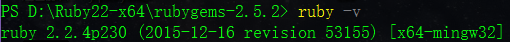

##使用 Jekyll 搭建自己的博客
######序言
大二就知道可以使用github搭建自己的博客，what's more，我还学了web2.0的课程，但是（罪恶的词语呀！！！），用博客园的模版还是挺方便的，最重要的还是我懒....囧，所以上到大三才想着自己去弄自己的博客，github上建议我们用Jekyll，那么我就来学学吧

######Jekyll简介
*摘抄(Jekyll中文网站)*：Jekyll 是一个简单的博客形态的静态站点生产机器。它有一个模版目录，其中包含原始文本格式的文档，通过一个转换器（如 Markdown）和我们的 Liquid 渲染器转化成一个完整的可发布的静态网站，你可以发布在任何你喜爱的服务器上。Jekyll 也可以运行在 GitHub Page 上，也就是说，你可以使用 GitHub 的服务来搭建你的项目页面、博客或者网站，而且是完全免费的。

######安装
- 官网windows安装教程：http://jekyll-windows.juthilo.com/

- 步骤如下：

 - 安装ruby：http://rubyinstaller.org/downloads/
 
 - 然后安装DevKit-mingw64：http://rubyinstaller.org/downloads/
   - 解压到一个目录
   - 进入到这个解压目录
   - `ruby dk.rb init`
   - `ruby dk.rb install`

 - 在命令行下安装Jekyll：`gem install jekyll`
    

 - windows下还需安装wdm，命令行安装：`gem install wdm`

- 语法高亮：
 - `gem install rouge`
   - 在_config.yml文件中加入：`highlighter: rouge`

 - 使用python的pip安装Pygments
   - 在_config.yml文件中加入：`highlighter: pygments`


######效果
- 命令行输入以下命令：
 - `jekyll new myblog`
 - `cd myblog`
 - `jekyll serve`


######遇到的错误
-  Error:  Permission denied - bind(2) for 127.0.0.1:4000
 - 端口号被占用，命令行输入：`netstat -an`可以查看端口号被占用情况，只需改变端口号就行，只需打开_config.yml 在最后加上一行 ，比如，`port: 8888`


###撰写博客
###### 创建文章的文件
- 发表一篇新文章，你所需要做的就是在_posts文件夹中创建一个新的文件。文件名的命名非常重要。Jekyll 要求一篇文章的文件名遵循下面的格式：
    `年-月-日-标题.MARKUP`
 - 在这里，年是4位数字，月和日都是2位数字。MARKUP扩展名代表了这篇文章是用什么格式写的。下面是一些合法的文件名的例子：

    `2011-12-31-new-years-eve-is-awesome.md`
	`2012-09-12-how-to-write-a-blog.textile`

###### 内容格式
 - 所有博客文章顶部必须有一段YAML头信息(YAML front- matter)。在它下面，就可以选择你喜欢的格式来写文章。 Jekyll 支持 Markdown ，以及其他众多格式的扩展，其中就包括十分流行的 Textile 。这些格式都有自己的方式来标记文章中不同类型的内容，所以你首先需要熟悉这些格式并选择一种最符合你需求的。

###### 引用图片和其它资源

 - 由于 Jekyll 的灵活性，有很多方式可以解决这个问题。一种常用做法是在工程的根目录下创建一个文件夹，命名为assets 或者 downloads，将图片文件，下载文件或者其它的资源放到这个文件夹下。然后在任何一篇文章中，它们都可以用站点的根目录来进行引用。这和你站点的域名/二级域名和目录的设置相关，下面有一些例子（Markdown 格式）来演示怎样利用site.url变量来解决这个问题。
   - 在文章中引用一个图片:
       ``

 - 如果你确信你的站点只在域名的根 URL 下做展示，你可以不使用`{{ site.url }}`变量。在这种情况下， 直接使用`/path/file.jpg`即可


######高亮代码片段
- Jekyll 自带语法高亮功能，你可以选择使用 Pygments 或 Rouge 两种工具中的一种。在文章中插入一段高亮代码非常容易，只需使用下面的 Liquid 标记：
  ```bash
	
	def show
	  @widget = Widget(params[:id])
	  respond_to do |format|
		format.html # show.html.erb
		format.json { render json: @widget }
	  end
	end
	
  ```

- 你可以在代码片段中增加关键字linenos来显示行数。 这样完整的高亮开始标记将会是:``。

######主页
- 像任何网站的配置一样，需要按约定在站点的根目录下找到` index.html `文件，这个文件将被做为主页显示出来。除非你的站点设置了其它的文件作为默认文件，这个文件就将是你的 Jekyll 生成站点的主页。

- 站点上任何 HTML 文件，包括主页，都可以使用 layout 和 include 中的内容作为公用的内容，如页面的 header 和 footer. 将合适的部分抽出放到布局中。

- 命名一个文件夹并包含一个 index.html 文件
 - 增加一个新页面的最简单方法就是把给 HTML 文件起一个适当的名字并放在根目录下。一般来说，一个站点下通常会有：主页 (homepage), 关于 (about), 和一个联系 (contact) 页。根目录下的文件结构和对应生成的 URL 会是下面的样子：

    ```bash
	.
	|-- _config.yml
	|-- _includes/
	|-- _layouts/
	|-- _posts/
	|-- _site/
	|-- about.html    # => http://yoursite.com/about.html
	|-- index.html    # => http://yoursite.com/
	└── contact.html  # => http://yoursite.com/contact.html
	```

 - 用 Jekyll 达到这种效果，你只需要为每个顶级页面创建一个文件夹，并包含一个 index.html 文件。这样，每个 URL 就将以文件夹的名字作为结尾，网站服务器会将对应的 index.html 展示给用户。下面是一个示例来展示这种结构的样子：

   ```bash
	.
	├── _config.yml
	├── _includes/
	├── _layouts/
	├── _posts/
	├── _site/
	├── about/
	|   └── index.html  # => http://yoursite.com/about/
	├── contact/
	|   └── index.html  # => http://yoursite.com/contact/
	└── index.html      # => http://yoursite.com/
   ```


