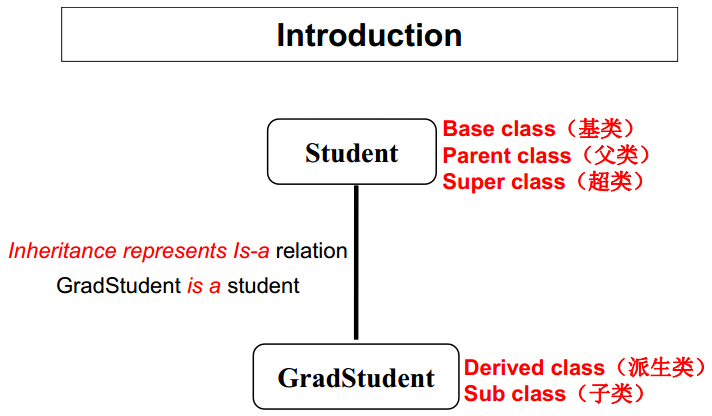
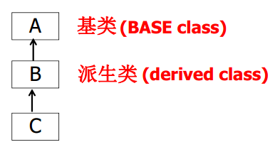
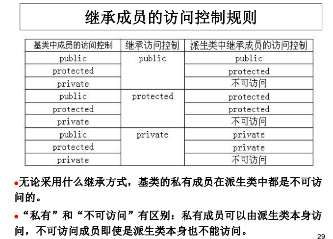
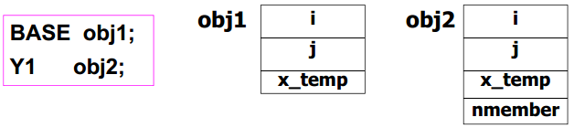
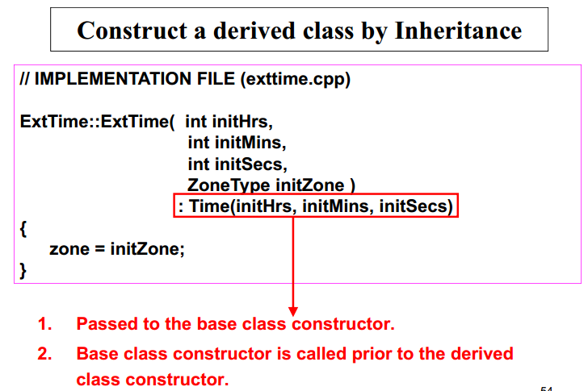
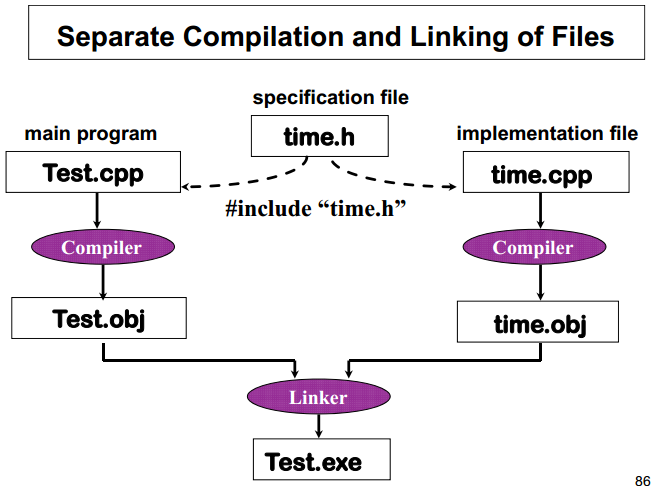
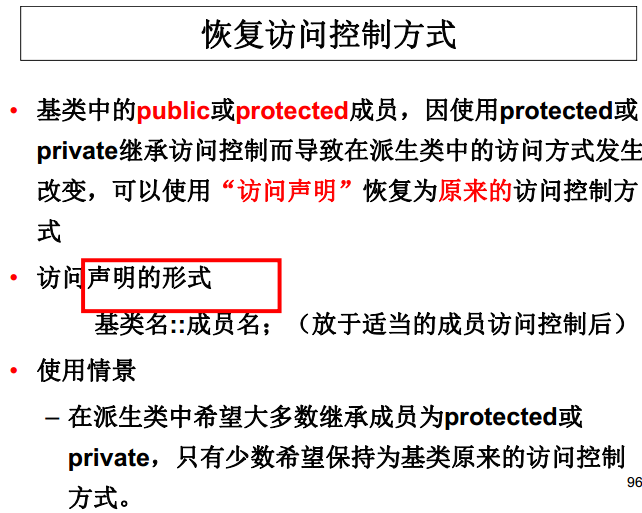
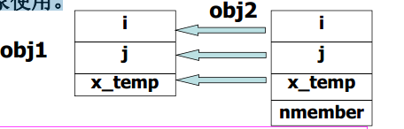
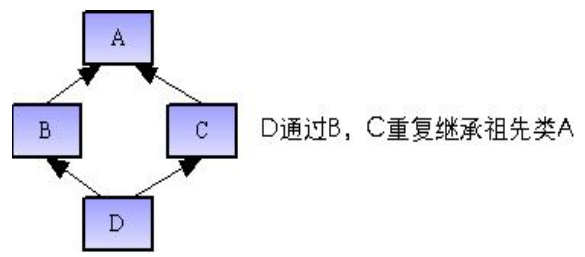

##Note
####Inheritance（继承）


- 使得程序可刻划现实世界的IS-A关系。

- 提高程序的可重用性
 - 派生类重用基类类的代码可提高程序开发效率。 派生类的定义通常基于设计完善、并经严格测试的基类，从而使程序设计工作建立在一个可靠的基础上，有助于高效地开发出可靠性较高的软件
 - 这种重用是一种灵活的重用方式：子类在继承父类代码的基础上，可根据自己的特性进行调整。

- 定义：“类B继承类A”或“类A派生类B”
  - 在类B中除了自己定义的成员之外，还自动包括了类A中定义的数据成员与成员函数，这些自动继承下来的成员称为类B的**继承成员**

   


- C++所支持的继承形式
  - 单重继承
  - 多重继承
  - 重复继承

######继承的语法
- 单重继承的定义形式

```cpp
class 派生类名： 继承访问控制 基类类名 {
    成员访问控制：
    成员声明列表；
};
```

- 继承访问控制和成员访问控制均由保留`public`、`protected`、 `private`来定义，缺省均为`private`。

######新成员的访问控制
- private（私有的）：
  - 在private后声明的成员称为私有成员，私有成员只能通过本类的成员函数来访问。

- public(公有的）：
  - 在public后声明的成员称为公有成员，公有成员用于描述一个类与外部世界的接口，类的外部（程序的其它部分的代码）可以访问公有成员。

- protected（受保护的）：
  - 受保护成员具有private与public的双重角色：对派生类的成员函数而言，它为public，而对类的外部而言，它为private。即：protected成员只能由本类及其后代类的成员函数访问。

- 影响继承成员（派生类从基类中继承而来的成员）访问控制方式的两个因素：
  - 定义派生类时指定的继承访问控制
  - 该成员在基类中所具有的成员访问控制

```cpp
class B： 继承访问控制 A {
	成员访问控制：
	    成员声明列表；
};
```




- 在大多数情况下，使用`public`的继承方式；`private`和`protected`是很少使用的。


######派生类对象的存储
- 派生类的对象不仅存放了在派生类中定义的非静态数据成员，而且也存放了从基类中继承下来的非静态数据成员

- 可以认为派生类对象中包含了基类子对象。



#####继承与构造函数、析构函数
######继承时的构造函数
- 基类的构造函数不被继承，派生类中需要声明自己的构造函数。

- 派生类的构造函数中只需要对本类中新增成员进行初始化即可。对继承来的基类成员的初始化是通过自动调用基类构造函数完成的。

- 派生类的构造函数需要给基类的构造函数传递参数。

- **构造函数的调用次序**（创建派生类对象时）
 - 首先调用其基类的构造函数（调用顺序按照基类被继承时的声明顺序（从左向右））。
 - 然后调用本类对象成员的构造函数（调用顺序按照对象成员在类中的声明顺序）。
 - 最后调用本类的构造函数。

- **析构函数的调用次序**
  - 撤销派生类对象时析构函数的调用次序与构造函数的调用次序相反
  - 首先调用本类的析构函数
  - 然后调用本类对象成员的析构函数
  - 最后调用其基类的析构函数


######向基类构造函数传递实参
- 若基类构造函数带参数，则定义派生类构造函数时通过初始化列表显式调用基类构造函数，并向基类构造函数传递实参。

- 带初始化列表的派生类构造函数的一般形式

  ```cpp
  派生类名(形参表) : 基类名(实参表)
  {
     派生类新成员初始化赋值语句;
  };
  ```




######Separate Compilation and Linking of Files
- .cpp被编译成.obj文件，同一程序中的各个obj文件被链接成.exe可执行文件。

- 在C++中，多文件程序中的各.cpp文件不但被单独编译（ separate compilation） ，而且可以在不同的时刻编译。

- 对于一个类，例如Time，其.h及.obj文件都应该可以被用户使用。用户把前者加入（ include）到自己的程序中，使得可以编写利用Time类的代码；用户也需要后者链接到他自己的程序上，以便创建可执行文件。



######Avoiding Multiple Inclusion of Header Files
- often several program files use the same header file containing typedef statements, constants, or class type declarations--but, it is a compile-time error to define the same identifier twice.

- this preprocessor directive syntax is used to avoid the compilation error that would otherwise occur from multiple uses of #include for the same header file

```cpp
#ifndef Preprocessor_Identifier
#define Preprocessor_Identifier
			:
#endif
```

######恢复访问控制


```cpp
class BASE {
    public:
        void set_i(int x) {
            i = x;
        }
		int get_i() {
		    return i;
		}
    protected:
        int i;
};
class DERIVED: private BASE {
    public:
	    BASE::set_i; // 访问声明
	    BASE::i;
	    void set_j(int x) {
	        j = x;
	    }
	    int get_ij() {
	        return i + j;
	    }
    protected:
    	int j;
};
int main() {
    DERIVED obj; // 声明一个派生类的对象
    obj.set_i(5); // set_i()已从私有的转为public
    obj.set_j(7); // set_j()本来就是公有的
    cout << obj.get_ij() << "\n"; // get_ij()本来就是公有的
    return 0;
}
```

######继承成员重定义
- 派生类中修改继承成员函数的语义（即，修改函数体，而**保持函数原型不变**）。

- 派生类中的名字支配（屏蔽）基类中的名字。


######重载继承成员
- 函数名相同，但函数首部不同（即参数列表不同；当然，函数实现一般也不同）。

- 利用重载，实现新的功能。

######屏蔽继承成员
- 目的：
  - 使得客户代码通过派生类对象不能访问继承成员。

- 方法：
  - 使用继承访问控制protected和private（真正屏蔽）
  - 在派生类中成员访问控制protected或private之后定义与继承成员函数相同的函数原型，而函数体为空（非真正屏蔽，仍可通过使用“基类名::成员名”访问）


######继承成员重命名
- 目的：
  - 解决名字冲突。
  - 在派生类中选择更合适的术语命名继承成员。

- 方法
  - 在派生类中定义新的函数，该函数调用旧函数；屏蔽旧函数。
  - 在派生类中定义新的函数，该函数的函数体与旧函数相同。

```cpp
string str = “abc”;
cout << str.length();
cout << str.size();
```

######类型兼容性
- 赋值运算的类型兼容性
 - 可以将后代类的对象赋值给祖先类对象，反之不可。
 - 每个派生类对象包含一个基类部分，这意味着可以将派生类对象当作基类对象使用。



- 指向基类对象的指针也可指向公有派生类对象

- 只有公有派生类才能兼容基类类型（上述规则只适用于公有派生）。


######Multi-inheritance
- Multi-inheritance: a derived class has more than one base classes.
- Represents the concept: C is both A and B.
- Takes the form as follows.

```cpp
class 派生类名：继承访问控制1 基类名1，
              继承访问控制2 基类名2， ...
{
      成员声明；
}
```

######Name clash(名字冲突)
- Name clash： Ambiguity occurs when there are members with same name in the base classes of a derived class and when client codes attempt to access this name via the objects of the derived class, i.e. the compiler can not decide which version to use.

- solutions
  - Using domain resolution operator to explicitly tell which version to use.
  - Redefinition the clashing members in derived class.

```cpp
class BASE1 {
    public: void show() { cout << i << "\n"; }
    protected: int i;
};
class BASE2 {
    public: void show() { cout << j << "\n"; }
    protected: int j;
};
// 多重继承引起名字冲突： DERIVED的两个基类BASE1和
//BASE2有相同的名字show
class DERIVED: public BASE1, public BASE2 {
    public: void set(int x, int y) { i = x;
        j = y; }
}; // 派生类在编译时不出错： C++语法不禁止名字冲突。
int main() {
    DERIVED obj; // 声明一个派生类的对象
    obj.set(5, 7); // set()是DERIVED类自身定义的
    // obj.show();
    // 二义性错误，编译程序无法决定调用哪一个版本
    obj.BASE1::show();
    // 正确，显式地调用从BASE1继承下来show()
    obj.BASE2::show();
    // 正确，显式地调用从BASE2继承下来show()
				:
				:
}

class DERIVED: public BASE1, public BASE2 {
    public: void set(int x, int y) { i = x;
        j = y; }
    void show() { cout << i << "\n";
        cout << j << "\n"; }
};
int main() {
    DERIVED obj; // 声明一个派生类的对象
    obj.set(5, 7); // set()是DERIVED类自身定义的
    obj.show(); // 无二义性问题，调用的是DERIVED中新定义的版本
    obj.BASE1::show(); // 仍然可调用从BASE1继承下来show()
    obj.BASE2::show(); // 仍然可调用从BASE2继承下来show()
    return 0;
}
```

######Constructor and destructor in multiple inheritance
- Sequence of calling base class constructors: left to right as in the inheritance declaration.

```cpp
class BASE1 {
    public:
        BASE1(int x) {
            cout << x << "->Constructing base1 object.\n";
        }
        ~BASE1() {
            cout << "Destructing base1 object.\n";
        }
};
class BASE2 {
    public:
        BASE2(int x) {
            cout << x << "->Constructing base2 object.\n";
        }
        ~BASE2() {
            cout << "Destructing base2 object.\n";
        }
};
class DERIVED: public BASE2, public BASE1 {
    public: DERIVED(int x, int y): BASE1(x),
    BASE2(y) { cout << "Constructing derived object.\n"; }
    ~DERIVED() { cout << "Destructing derived object.\n"; }
};
int main() {
    DERIVED obj(10, 20); // 声明一个派生类的对象
    return 0;
}
```

- output:
```bash
20->Constructing base2 object.
10->Constructing base1 object.
Constructing derived object.
Destructing derived object.
Destructing base1 object.
Destructing base2 object.
```

######Base inherited twice or more
- In a derived class, base members may be inherited twice or more in case of multiple inheritance.



- In C++， duplicate inheritance is the default case. Ambiguity may occur.

- In C++, duplicate inheritance or shared inheritance is applied to the entire base class, NOT to just some particular members of the base class.

- **solutions**
  - Using :: explicitly

- **Virtual base(虚基类)**
  - Reserved word `virtual` is added before the inheritance access control when the base class is inherited. Then this base class is a virtual base class.
  - Virtual base class is used for shared inheritance.
  - 普通基类与虚基类之间的唯一区别只有在派生类重复继承了某一基类时才表现出来。

```cpp
class BASE { public: int i; };
class BASE1: virtual public BASE {
    public: int j;
};
class BASE2: virtual public BASE {
    public: int k;
};
class DERIVED: public BASE1, public BASE2 {
    public: int sum;
};
int main() {
    DERIVED obj; // 声明一个派生类对象
    obj.i = 3; // 正确：从BASE继承的i在DERIVED中只有一份
    obj.j = 5; // 正确：使用从BASE1继承的j
    obj.k = 7; // 正确：使用从BASE2继承的k
    return 0;
}
```

######虚基类的构造函数与析构函数
- 若派生类有一个虚基类作为祖先类，则在派生类构造函数中需要列出对虚基类构造函数的调用（否则，调用虚基类的默认构造函数），且对虚基类构造函数的调用总是先于普通基类的构造函数。

- 创建后代类对象时，只有该后代类列出的虚基类构造函数被调用，这样就保证了虚基类的唯一副本只被初始化一次。

- 创建派生类对象时构造函数的调用次序：
 - 最先调用虚基类的构造函数；
 - 其次调用普通基类的构造函数，多个基类则按派生类声明时列出的次序、从左到右调用，而不是初始化列表中的次序；
 - 再次调用对象成员的构造函数，按类声明中对象成员出现的次序调用，而不是初始化列表中的次序
 - 最后执行派生类的构造函数。

```cpp
class baseA {
    public:
        baseA() {
            cout << endl << "This is baseA class." << endl;
        }
};
class baseB {
    public:
        baseB() {
            cout << endl << "This is baseB class." << endl;
        }
};
class derivedA: public baseB, virtual public baseA {
    public: derivedA() {
        cout << endl << "This is derivedA class." << endl;
    }
};
class derivedB: public baseB, virtual public baseA {
    public: derivedB() {
        cout << endl << "This is derivedB class." << endl;
    }
};
class Derived: public derivedA, virtual public derivedB {
    public: Derived() {
        cout << endl << "This is Derived class." << endl;
    }
};
int main() {
    Derived obj;
    return 0;
}
```

- 结果：
```bash
This is baseA class.
This is baseB class.
This is derivedB class.
This is baseB class.
This is derivedA class.
This is Derived class.
```

