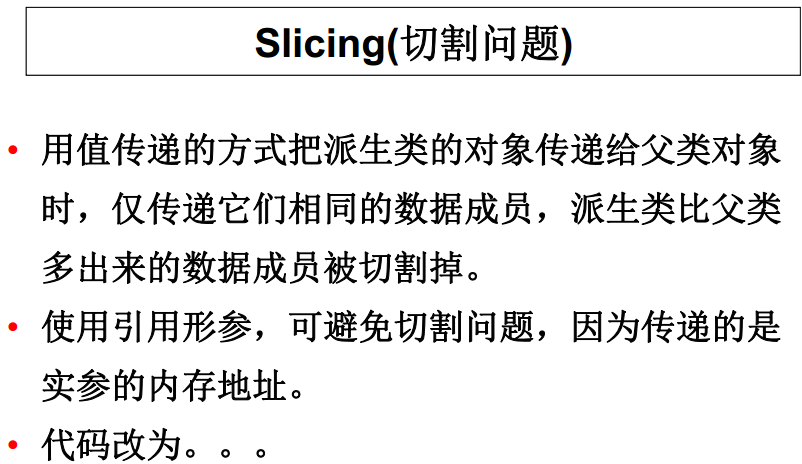
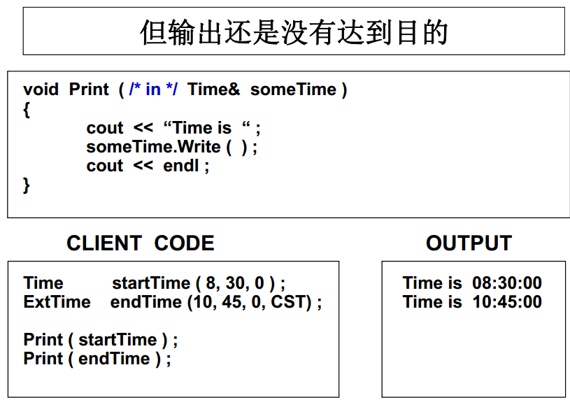
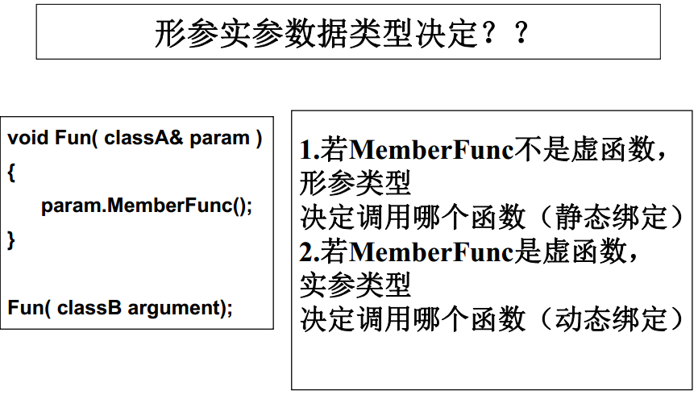
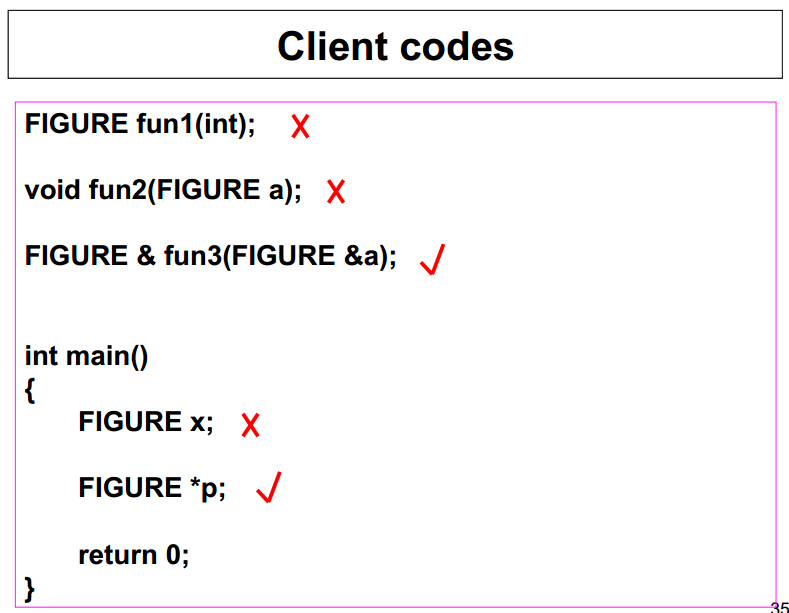

##C++ Note
####Polymorphism
- Polymorphism refers to the ability to associate multiple meanings to one character or one identifier especially to one function name

- Polymorphism Example: function overloading

   ```cpp
   int abs(int x) // 整数类型数据的绝对值函数
{
    cout << "Using integer version of abs().\n";
    return (x >= 0 ? x : -x);
}
double abs(double x) // 浮点类型数据的绝对值函数
{
    cout << "Using floating-point version of abs().\n";
    return (x >= 0.0 ? x : -x);
}
long abs(long x) // 长整数类型数据的绝对值函数
{
    cout << "Using long integer version of abs().\n";
    return (x >= 0 ? x : -x);
}
int main() {
    cout << abs(-5) << "\n"; // 调用abs()的整数版本
    cout << abs(-5 L) << "\n"; // 调用abs()的长整数版本
    cout << abs(3.14) << "\n"; // 调用abs()的浮点版本
    return 0;
}
   ```

######Two types of polymorphism
- Compile-time polymorphism(编译时多态性)：
  - association done in compile time, including
    - （ 1） function overloading
    - （ 2） operator overloading

- Run-time polymorphism(运行时多态性)： association done during run time. Implemented by dynamic biding( inheritance plus virtual function).

######binding（绑定）
- Binding is the process of associating a function call and a function definition.

- Two types of biding
  - Static biding（ Early biding）
    - Done during compile-time
    - Applied to non-virtual function.

 - Dynamic biding（ late biding）
   - Done during run-time.
   - Applied to virtual function.

######virtual function(虚函数)
- A virtual function is a member function with reserved word `virtual` of a class.

- `一旦为虚，永远为虚`： The virtual function of a base will always be virtual in its derived classes.

- 主要作用：与继承相结合以实现运行时多态性。在公有继承层次中的一个或多个派生类中对虚函数进行重定义，然后通过指向基类的指针（或引用）调用虚函数来实现实现运行时多态性。

- Polymorphism class: class that contains virtual function(s).

######Static Binding
- is the compile-time determination of which function to call for a particular object based on the type of the formal parameter.

- when pass-by-value is used, static binding occurs.



######Dynamic Binding
- Is the run-time determination of which function to call for a particular object of a descendant class based on the type of the argument.

- Declaring a member function to be virtual instructs the compiler to generate code that guarantees dynamic binding.



- 动态绑定的另一实现方式：使用引用形参

```cpp
//功能：演示通过基类引用实现动态绑定
//类的定义同上例（略）
void print_identity(BASE & me) {
    me.who(); //通过基类引用调用虚函数
}
void main() {
    BASE b_obj;
    FIRST_D f_obj;
    SECOND_D s_obj;
    print_identity(b_obj);
    print_identity(f_obj);
    print_identity(s_obj);
}

输出结果：
BASE
The First Derivation
The Second Derivation
```

######关于虚函数的说明
- 用虚函数实现动态绑定的关键：必须用基类指针（或基类引用）来访问虚函数。

- 若一函数是类中的虚函数，则称该函数具有虚特性。

- 在派生类中重定义从基类中继承过来的虚函数(函数原型保持不变)，该重定义的函数在该派生类中仍是虚函数。

- 函数重载，虚特性丢失。

- 当一个派生类没有重新定义虚函数时，则使用其基类定义的虚函数版本。

- 虚函数例子

```cpp
class BASE {
    public:
        virtual void f1() { cout << "BASE::f1()" << endl; }
		virtual void f2() { cout << "BASE::f2()" << endl; }
		virtual void f3() { cout << "BASE::f3()" << endl; }
		void f() { cout << "BASE::f()" << endl; }
};
class DERIVED: public BASE {
    public:
		void f1() { cout << "DERIVED::f1()" << endl; }
			//虚函数的重定义,f1在该类中还是虚函数
		void f2(int) { cout << "DERIVED::f2()" << endl; }
		//f2是函数重载，虚特性丢失
		void f() { cout << "DERIVED::f()" << endl; } // 普通函数的重定义
};
int main() {
    DERIVED d;
    BASE * p = & d; // 基类指针p指向派生类对象
    p - > f1(); //调用DERIVED::f1( ); 动态绑定
    p - > f2(); //调用BASE::f2( ); 静态绑定
    p - > f(); //调用BASE::f( ); 静态绑定
    ((DERIVED * ) p) - > f2(100); //调用DERIVED::f2( ); 静态绑定
    return 0;
}
```

######abstract class (抽象类)
- Pure virtual function(纯虚函数)： a virtual function declared but without definition within a base class. Each derived class of this base must redefine and implement this function.

 - format：
     `virtual 返回值类型 函数名(形参表) =0 ;`

- Abstract class： a class that contains pure virtual function.

- Syntax of abstract class
  - Can only be used as a base class.
  - Can not declare objects of an abstract class.
  - Can not be used for parameter type or returned type of a function.
  - Can not be used in explicit conversion.
  - Can declare pointers or references of an abstract class.




