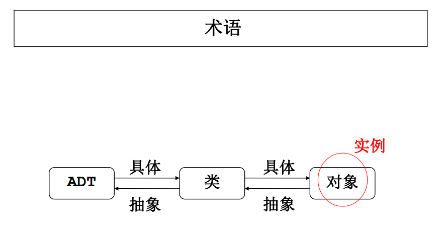

##C++ Note
######对象指针
- 对象是一种复合型的数据，往往占据比较多内存空间；如果程序中需要使用很多对象，可能容易造成内存紧张。

- 解决方法：在程序需要对象时创建对象，在对象使用完毕后撤销这个对象。

- 实现这一方法就要使用指向对象的指针。

######关于delete
- 用new分配的内存在不再使用时，要用delete释放。

- delete释放的是指针所指对象占据的内存。

- 用delete释放空间后，指针的值仍是原来指向的地址，但指针已无效（重复释放将出错）。

- delete对象指针，会调用该对象的析构函数。

- 若使用new运算分配的是数组（尤其是类类型对象的数组），则用delete释放时必须注意加上方括号[]。

- **注意**：由于delete一个指针即等同于释放掉该指针所指向的内存空间，而在C++中同一内存空间的释放只能进行一次；已delete过的指针再次delete会产生错误。因此，最好不要让多个指针指向同一个对象（多个指针同时指向同一内存空间的现象称为“指针别名”）。

######内存垃圾
- 程序不再需要动态创建的对象时，一定要记住释放掉这些对象。否则这些空间会一直被占用，无法分配给别程序使用；如果指向这些空间的指针指向了别处，将无法回收这些内存空间。
- 这 些 无 法 回 收 的 内 存 空 间 称 为 内 存 垃 圾（ garbage）。内存垃圾不断增加会消耗掉大量内存空间，有时会导致系统崩溃。

######对象复制

 - 在C++中，一个对象可以直接赋值给相同类型的另一个对象，这就是对象的复制。例如：

  ```bash
    DATE date1, date2;
	. . .
	date2 = date1; //复制
```

 - C++提供的这种复制策略称为浅复制（ shallow copy），在数据成员中不出现指针时，是没有任何问题的。但在数据成员中出现指针时，就很可能出现问题。

  

######const Member Data （常量数据成员）
- 常量数据成员的声明与符号常量（命名常量）的声明类似。
- 常量数据成员是对象的数据成员， 不能在声明时初始化，且常量一旦声明之后就不能再作为左值，所以只能在构造函数的初始化列表中对常量数据成员进行初始化。

  ```bash
  class Demo {
	public:
	  Demo( ): data1(0) // 常量数据成员只能在构造函数初始化列表中初始化
	  {
		// data1 = 0; // 此处不能对常量数据成员data1赋值
		data = 0;
	}
	private:
	  int data; // 一般的数据成员
	  const int data1; // 常量数据成员
  };
  ```

######类的静态成员
- 静态（ static）成员是类的组成部分但不是任何对象的组成部分

- 通过在成员声明前加上保留字static将成员设为static（在数据成员的类型前加保留字static声明静态数据成员；在成员函数的返回类型前加保留字static声明静态成员函数）

- static成员遵循正常的公有/私有访问规则。 C++程序中，如果访问控制允许的话，可在类作用域外直接（不通过对象）访问静态成员（需加上类名和::）

- 静态数据成员具有静态生存期，是类的所有对象共享的存储空间，是整个类的所有对象的属性，而不是某个对象的属性。

- 与非静态数据成员不同，静态数据成员不是通过构造函数进行初始化，而是必须在类定义体的外部再定义一次，且恰好一次，通常是在类的实现文件中再声明一次，而且此时不能再用static修饰。

- 静态成员函数不属于任何对象

- 静态成员函数没有this指针

- 静态成员函数不能直接访问类的非静态数据成员，只能直接访问类的静态数据成员


######this指针的使用
- 在成员函数中需要区别形参与数据成员时，就需要明确写出`this`

 ```bash
	void DATE::Set(int year, int month, int day)
	{
		this->month = month;
		this->day = day;
		this->year = year;
	}
 ```


######构造函数
- 默认构造函数，不带参数


- 正常构造函数，待参数


- 拷贝构造函数，复制已有对象

 - 形参类型为该类类型本身且参数传递方式为按引用传递。
 - 用一个已存在的该类对象初始化新创建的对象。
 - 每个类都必须有拷贝构造函数：
   - 用户可根据自己的需要显式定义拷贝构造函数。
   - 若用户未提供，则该类使用由系统提供的缺省拷贝构造函数。
   - 缺省拷贝构造函数使用逐位复制方式利用已存在的对象来初始化新创建的对象（相当于赋值=）。

- 拷贝构造函数的一般形式
 - 用类类型本身作形式参数。
 - 该参数传递方式为按引用传递，避免在函数调用过程中生成形参副本。
 - 该形参一般声明为const， 以确保在拷贝构造函数中不修改实参的值
     `C::C(const C& obj);`


- **关于拷贝构造函数的提示**

 - 对于不含指针成员的类，使用系统提供（编译器合成）的缺省拷贝构造函数即可。
 - 缺省拷贝构造函数使用浅复制策略，因此对含指针成员的类并不能满足需要。
 - 含指针成员的类通常应在构造函数（及拷贝构造函数）中分配内存，在析构函数中释放内存。


######Composition(组合)
- 对象成员：在类中声明的具有类类型的数据成员

- 为了初始化对象成员，类的构造函数必须调用对象成员所属类的构造函数，如：

  ```bash
	class C
	{
		CLASS_1 obj1;
		CLASS_2 obj2;
		…
		CLASS_N objn;
	};
	C::C(参数表0): obj1(参数表1), obj2(参数表2), …, objn(参数表n)
	{ … }
  ```

######关于面向对象程序设计的若干基本问题
- 面向对象程序设计

- 是一种理念（ idea）： 思维和方法论的问题。

- 是某种语言里面支持面对对象的具体机制： 程序语言的运用问题----（类和对象、继承、多态性和模板等）。


######面向过程设计
- 利用这种方式思考问题时，我们把问题看成是什么？

- 在构建大型软件系统时，面向过程的设计往往导致程序有两大致命缺陷：

 - 导致程序结构不灵活。若高层算法需要修改，那么可能底层的算法也因此需要修改。
 - 导致代码难以复用。

######面向对象的程序设计
- 面向对象的程序设计（ object oriented design, OOD）已被证明是开发和维护大型软件的更好的设计方式，它在程序结构、代码复用、封装隐藏等方面，有着面向过程设计难以企及的优势。

- Q：什么是对象？
  - A：一般说来， 任何事物都可以看成对象。我们要考察或研究现实或思维世界中的某个实体，那么它就成为我们的对象。

- Q： OOD把问题视作什么？
  - A：是把问题视作各类实体（对象）的组合。

- Q：它关注对象的什么？
  - A：它关注对象中包含的数据及作用于这些数据之上的操作，也需要关注对象之间的关系和相互作用。

- Q：如何确认问题中的对象？
  - 一般来说，我们需要在问题域中寻求对象，即仔细研究问题的定义，从中搜索各重要的名词和动词。名词很可能就是对象，而动词可能就是对象的操作。


######面向过程 vs 面向对象





