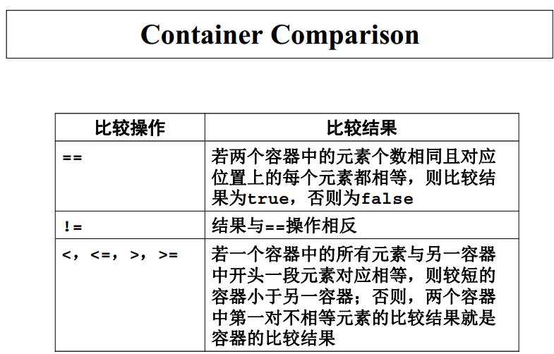
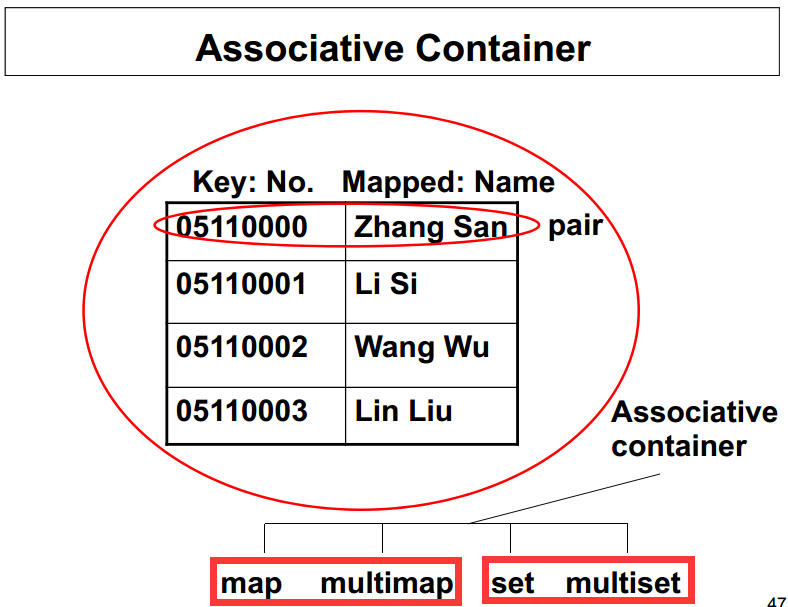

##C++ Note
####STL(Standard Template Library标准模板库)
- 快速查找网页链接：http://www.cplusplus.com/

######Container Adapter
- 标准库中定义的容器适配器都是基于顺序容器建立的。

- 程序员在创建适配器对象时可以选择相应的基础容器类。
  - 1） stack适配器可以建立在vector、 list或deque容器上。
  - 2） queue适配器只能建立在list或deque容器上。
  - 3） priority_queue适配器只能建立在vector或list容器上。

- 如果创建适配器对象时不指定基础容器，则stack和queue默认采用deque实现，而priority_queue则默认采用vector实现

######Generic algorithm
- “泛型”：算法与具体的容器类型无关，而且一般也不依赖于元素的类型（除了要求元素类型必须支持比较操作之外）。

- 四大类：
  - 1、不修改序列的算法（ non-modifying sequence algorithm）
  - 2、变更序列的算法（ mutating-sequence algorithm）
  - 3、排序及相关算法（ sorting and related algorithm）
  - 4、泛化算术算法（ generalized numeric algorithm）

- 前三类算法都在头文件`<algorithm>`中定义，泛化算术算法在头文件`<numeric>`中定义 。

