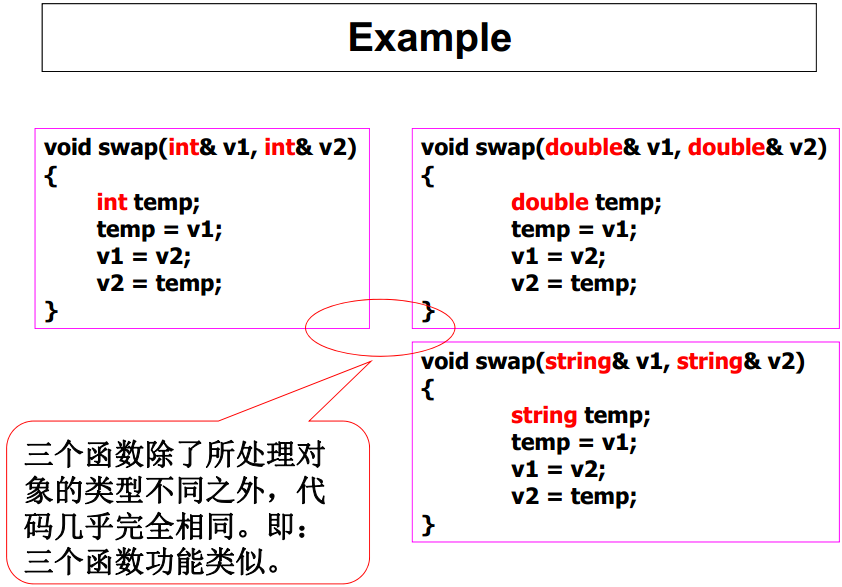
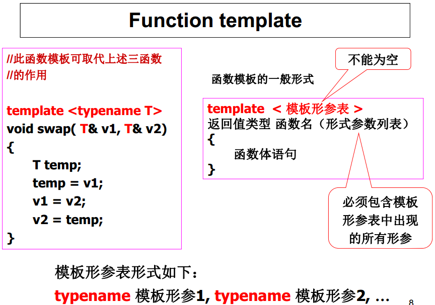
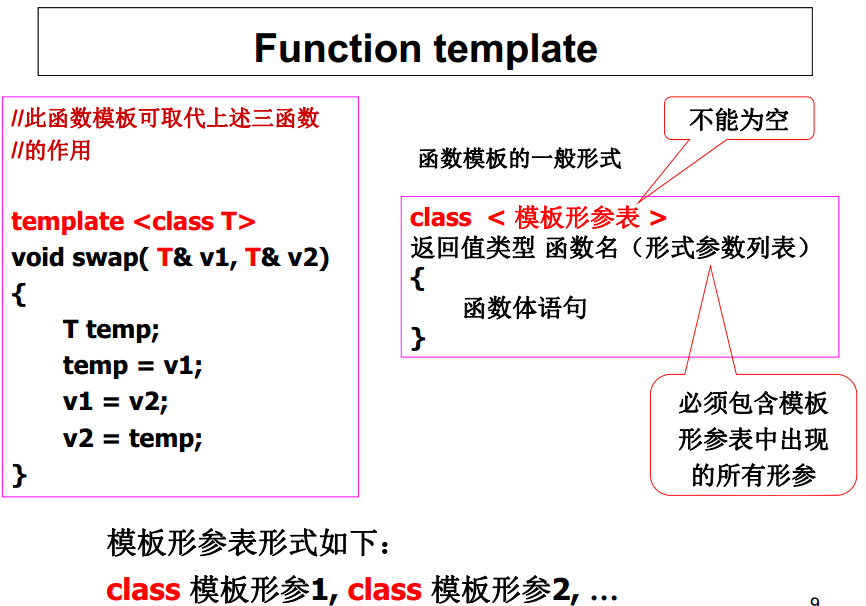

##C++ Note
####Generic programming(泛型编程)
- Generic programming： programming independent of any particular data types by which data(objects) of different types can be manipulated by the same codes.

- Particular data type is determined when the instance code is created from generic code.

- Generic programming is one kind of compile-time polymorphism in which data type itself is **parameterized**（参数化） so that the program has polymorphism characteristics.

- **Instantiation**(实例化) is the process in which different instance codes are created from the same generic code by the compiler.

- In C++, `template` is used for generic programming.
  - Function template
  - Class template

######Function template
- Same processing on data of different types.
  - Code reduction
  - Can be used when the data type is not known when programming.





- 调用函数模板的实际过程：
 1. 模板实参推断（ template argument deduction）：编译器根据函数调用中所给出的实参的类型，确定相应的模板实参。
 2. 函数模板的实例化（ instantiation）：模板实参确定之后，编译器就使用模板实参代替相应的模板形参，产生并编译函数模板的一个特定版本（称为函数模板的一个实例（ instance））（注意：此过程中不进行常规隐式类型转换）。

- 对函数模板进行重载：定义名字相同而函数形参表不同的函数模板，或者定义与函数模板同名的非模板函数，在其函数体中完成不同的行为。

######如何确定调用哪个函数？
- 静态绑定：编译时将一个函数调用关联到特定的函数体代码的过程。

- 函数调用的静态绑定规则
  1. 如果某一同名非模板函数的形参类型正好与函数调用的实参类型匹配（完全一致），则调用该函数。否则，进入第2步。
  2. 如果能从同名的函数模板实例化一个函数实例，而该函数实例的形参类型正好与函数调用的实参类型匹配（完全一致），则调用该函数实例。否则，进入第3步。
  3. 对函数调用的实参作隐式类型转换后与非模板函数再次进行匹配，若能找到匹配的函数则调用该函数。否则，进入第4步。
  4. 提示编译错误。

```cpp
template < typename T >
    void demoFunc(const T v1,
        const T v2) {
        cout << "the first generic version of demoFunc()" << endl;
        cout << "the arguments: " << v1 << " " << v2 << endl;
    }
    // 定义函数模板demoFunc的重载版本
template < typename T >
    void demoFunc(const T v) {
        cout << "the second generic version of demoFunc()" << endl;
        cout << "the argument: " << v << endl;
    }
    // 定义重载函数模板demoFunc的非模板函数
void demoFunc(const int v1,
    const int v2) {
    cout << "the ordinary version of demoFunc()" << endl;
    cout << "the arguments: " << v1 << " " << v2 << endl;
}
int main() {
    char ch1 = 'A', ch2 = 'B';
    int iv1 = 3, iv2 = 5;
    double dv1 = 2.8, dv2 = 8.5;
    // 调用第一个函数模板的实例
    demoFunc(dv1, dv2);
    // 调用第二个函数模板的实例
    demoFunc(iv1);
    // 调用非模板函数demoFunc(int, int)
    demoFunc(iv1, iv2);
    // 调用非模板函数demoFunc(int, int)（进行隐式类型转换）
    demoFunc(ch1, iv2);
    return 0;
}
```

######类模板
- 使用情景：定义可以存放任意类型对象的通用容器类
  - 例如，定义一个栈（ stack）类，即可用于存放int型对象，又可用于存放float、 double、 string…甚至任意未知类型的元素

- 实现方式：为类声明一种模式，使得类中的某些数据成员、某些成员函数的参数、某些成员函数的返回值，能取任意类型（包括基本类型和用户自定义类型）

- 定义形式：

```cpp
template < 模板形参表 >
class 类模板名
{ 类成员声明 };
```

 - 其中，模板形参表形式如下：typename 模板形参1, typename 模板形参2, …

- 在类模板以外定义其成员函数，则函数首部形式如下：
```cpp
template <模板形参表>
返回值类型 类模板名<模板形参名列表>::函数名( 函数形参表 )
```

######类模板的实例化
- 类模板是一个通用类模型，而不是具体类，不能用于创建对象，只有经过实例化后才得到具体类，才能用于创建对象。

- 实例化的一般形式：
   `类模板名 < 模板实参表 >`

- 模板实参是一个实际类型。

- 一个类模板可以实例化为多个不同的具体类。
```cpp
Stack<int> stack_int；
Stack<double> stack_double;
Stack<string> stack_string;
```


