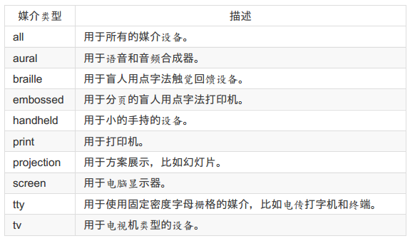
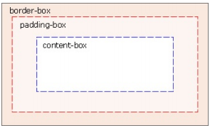

##样式表
可以对文档进行格式化
- 外部插入
 - 在html文档的`<head> </head>`中插入添加
  
  ```bash
  <link rel="stylesheet" type="text/css" href="mystyle.css">
  ```
- 内部样式表
 - 可以在head部分通过`<style>`标签定义

 ```bash
<style type="text/css">
	body {
		background-color: red
	}
	p {
		margin-left: 20px
	}
</style>
 ```
- 内联样式表
 - 特殊的样式应用到个别元素
 
 ```bash
 <p style="color: red; margin-left: 20px">
This is a paragraph
</p>
 ```

- 其他常用样式
| 标签 | 描述 |
|--------|--------|
|`<style>`| 定义样式定义    |
|`<link>` | 定义资源应用|
|`<div>`| 定义文档中的节或区域(块级)|
|`<span>`|定义文档中行内小块或区域|
|`<font>`|字体|
|`<basefont>`|基准字体|
|`<center>`|居中显示|

- background-color 属性为元素设置背景色
- background-image 属性把图像放入背景

 ```bash
 body {background-image: url(img/eg_bg_04.gif);}
 ```

- background-repeat 属性背景重复
 - repeat-x 和 repeat-y 分别导致图像只在水平或垂直方向上重复
 - no-repeat 则不允许图像在任何方向上平铺。

   ```bash
   body {
     background-image:url(img/eg_bg_03.gif);
     background-repeat: repeat-y;
   }
   ```

- background-position 属性,给背景定位
 
 ```bash
 body {
	background-image:url('/i/eg_bg_03.gif');
	background-repeat:no-repeat;
	background-position:center;
 }
 ```

- 关键字
 - 图像放置关键字最容易理解， 其作用如其名称所表明的。 例如， top right 使图像放置在元素内边距区的右上角。
 - 根据规范， 位置关键字可以按任何顺序出现， 只要保证不超过两个关键字 - 一个对应水平方向， 另一个对应垂直方向。
 - 如果只出现一个关键字， 则认为另一个关键字是 center。

- 背景关联
 - 如果文档比较长， 那么当文档向下滚动时， 背景图像也会随之滚动。 当文档滚动到超过图像的位置时， 图像就会消失。
 - 可以通过 background-attachment 属性防止这种滚动,属性的默认值是 scroll， 也就是说， 在默认的情况下， 背景会随文档滚动。
 
 ```bash
 body {
	 background-image:url(img/eg_bg_02.gif);
	 background-repeat:no-repeat;
	 background-attachment:fixed
 }
 ```

- 缩进文本
 - 把 Web 页面上的段落的第一行缩进， 这是一种最常用的文本格式化效果。CSS 提供了 text-indent 属性， 该属性可以方便地实现文本缩进。

 ```bash
 p {text-indent: 5em;}
 ```

 - text-indent 属性可以继承

- 水平对齐
 - text-align 是一个基本的属性， 它会影响一个元素中的文本行互相之间的对齐方式。
 -  justify：在两端对齐文本中， 文本行的左右两端都放在父元素的内边界上。 然后， 调整单词和字母间的间隔， 使各行的长度恰好相等。 

- 字间隔
 - word-spacing 属性可以改变字（ 单词） 之间的标准间隔。 其默认值 normal 与设置值为 0 是一样的。
 - word-spacing 属性接受一个正长度值或负长度值。 如果提供一个正长度值， 那么字之间的间隔就会增加。 为 word-spacing 设置一个负值， 会把它拉近：

   ```bash
 p.spread {word-spacing: 30px;}
p.tight {word-spacing: -0.5em;}
<p class="spread">
This is a paragraph. The spaces between words will be increased.
</p>
<p class="tight">
This is a paragraph. The spaces between words will be decreased.
</p>
   ```

- 字母间隔
 - letter-spacing 属性与 word-spacing 的区别在于， 字母间隔修改的是字符或字母之间的间隔。
 
   ```bash
 h1 {letter-spacing: -0.5em}
h4 {letter-spacing: 20px}
<h1>This is header 1</h1>
<h4>This is header 4</h4>
   ```

- 字符转换
 - none
 - uppercase
 - lowercase
 - capitalize：每个单词的首写字母大写

   ```bash
 h1 {text-transform: uppercase}
   ```

- 文本装饰
 - text-decoration 属性
   - none
   - underline
   - overline
   - line-through
   - blink

- 处理空白符
 - white-space 属性会影响到用户代理对源文档中的空格、 换行和 tab 字符的处理。
 - 可以用以下声明显式地设置这种默认行为：

   ```bash
   p {white-space: normal;}
   ```

 - 如果将 white-space 设置为 pre， 受这个属性影响的元素中， 空白符的处理就有所不同， 其行为就像 XHTML 的 pre 元素一样；空白符不会被忽略。

    ```bash
	p {white-space: pre}
	```

 - nowrap：会防止元素中的文本换行
 - pre-wrap：该元素中的文本会保留空白符序列， 但是文本行会正常地换行。如果设置为这个值， 源文本中的行分隔符以及生成的行分隔符也会保留。
 - pre-line：pre-line 与 pre-wrap 相反， 会像正常文本中一样合并空白符序列， 但保留换行符。

- 文本方向
 - direction 属性影响块级元素中文本的书写方向、 表中列布局的方向、 内容水平填充其元素框的方向、 以及两端对齐元素中最后一行的位置。

######css字体
- CSS 字体属性定义文本的字体系列、 大小、 加粗、 风格（ 如斜体） 和变形（ 如小型大写字母） 。
- font-family 属性 定义文本的字体系列。
- 字体风格
 - normal
 - italic：斜体
 - oblique：倾斜

- 字体变形
 - font-variant 属性可以设定小型大写字母。

- 字体加粗
 - font-weight 属性设置文本的粗细。

- 字体大小
 - font-size 属性设置文本的大小。
 - 16px=1em

######CSS链接
- 链接的四种状态：
 - a:link - 普通的、 未被访问的链接
 - a:visited - 用户已访问的链接
 - a:hover - 鼠标指针位于链接的上方
 - a:active - 链接被点击的时刻

- a:hover 必须位于 a:link 和 a:visited 之后

- a:active 必须位于 a:hover 之后

- 文本修饰
 - text-decoration 属性大多用于去掉链接中的下划线：

   ```bash
   a:link {text-decoration:none;}
   a:visited {text-decoration:none;}
   a:hover {text-decoration:underline;}
   a:active {text-decoration:underline;}
   ```

- 背景色
 - background-color 属性规定链接的背景色：

######CSS列表
- 要修改用于列表项的标志类型， 可以使用属性 list-style-type：

 ```bash
 ul {list-style-type : square}
 ```

- 对各标志使用一个图像，这可以利用 list-style-image:

 ```bash
 ul li {list-style-image : url(xxx.gif)}
 ```

######CSS表格
- 表格边框
 -  border 属性

    ```bash
	table, th, td {
	    border: 1px solid blue;
	}
	```

- border-collapse 属性设置是否将表格边框折叠为单一边框：

 ```bash
 table {
     border-collapse:collapse;
 }
 table,th, td {
     border: 1px solid black;
 }
 ```

- 表格宽度和高度
 - 通过 width 和 height 属性定义表格的宽度和高度。

- 表格文本对齐
 - text-align 和 vertical-align 属性设置表格中文本的对齐方式。
 - text-align 属性设置水平对齐方式， 比如左对齐、 右对齐或者居中：

    ```bash
	td {
	    text-align: right;
	}
	```

 - vertical-align 属性设置垂直对齐方式， 比如顶部对齐、 底部对齐或居中对齐：

    ```bash
	td {
	    height: 50%;
		vertical-align:bottom;
	}
	```

- 表格内边距
 - padding

- 表格颜色
 - color、background-color

######CSS轮廓
- 轮廓（ outline） 是绘制于元素周围的一条线， 位于边框边缘的外围， 可起到突出元素的作用。
- CSS outline 属性规定元素轮廓的样式、 颜色和宽度。
- outline：设置所有属性
- outline-color：轮廓颜色
- outline-style：轮廓样式
- outline-width：轮廓宽度

######CSS框模型
- CSS 框模型 (Box Model) 规定了元素框处理元素内容、 内边距、 边框 和 外边距的方式。
- **CSS框模型概述**

 

- 许多元素将由用户代理样式表设置外边距和内边距。 可以通过将元素的 margin 和 padding 设置为零来覆盖这些浏览器样式。

 ```bash
 * {
     margin: 0;
	 padding: 0;
 }
 ```

- CSS内边距
 - CSS padding属性

 ```bash
 h1 {padding: 10px;}
 ```

 - 按照上、 右、 下、 左的顺序分别设置

 ```bash
 h1 {padding: 1px 1px 1px 1px;}
 ```

 - 单边内边距属性
   - padding-top
   - padding-right
   - padding-bottom
   - padding-left

 - 百分数值是相对于其父元素的width计算的。

######CSS边框
- border，有三方面，宽度，样式，以及颜色
- border-style：

 ```bash
 p.aside {border-style: solid dotted dashed double;}
 ```

- 单边样式
 - border-top-style
 - border-right-style
 - border-bottom-style
 - border-left-style

- border-width 属性为边框指定宽度
 - 同样可以设置单边样式
   - border-top-width
 -  border-style 的默认值是 none， 如果没有声明样式， 就相当于 border-style:none。 因此， 如果您希望边框出现， 就必须声明一个边框样式。

- 边框颜色
 - border-color 属性，一次最多可接受4个颜色值

    ```bash
	p {
	    border-color: blue rgb(25%, 35%, 45%) #909090 red;
	}
	```

 - 默认的边框颜色是元素本身的前景色。 如果没有为边框声明颜色， 它将与元素的文本颜色相同。 另一方面， 如果元素没有任何文本， 假设它是一个表格， 其中只包含图像， 那么该表的边框颜色就是其父元素的文本颜色（ 因为 color 可以继承） 。 这个父元素很可能是 body、 div 或另一个 table。

 - 定义单边颜色，如：
   - border-top-color

- 透明边框

 - CSS2 引入了边框颜色值 transparent。 这个值用于创建有宽度的不可见边框。 

######CSS外边距
- 围绕在元素边框的空白区域是外边距。 设置外边距会在元素外创建额外的“空白”。
- 设置外边距的最简单的方法就是使用 margin 属性， 这个属性接受任何长度单位、百分数值甚至负值。

- 与内边距的设置相同， 这些值的顺序是从上外边距 (top) 开始围着元素顺时针旋转的：

 - `margin: top right bottom left`

 - 如果缺少左外边距的值， 则使用右外边距的值。
 - 如果缺少下外边距的值， 则使用上外边距的值。
 - 如果缺少右外边距的值， 则使用上外边距的值。

  

 - 单边外边距

   ```bash
   p {margin-left: 20px;}   
   ```

- CSS外边距合并

 - 外边距合并指的是， 当两个垂直外边距相遇时， 它们将形成一个外边距。
 - 只有普通文档流中块框的垂直外边距才会发生外边距合并。 行内框、 浮动框或绝对定位之间的外边距不会合并。

######CSS定位
- 只有普通文档流中块框的垂直外边距才会发生外边距合并。 行内框、 浮动框或绝对定位之间的外边距不会合并。

- CSS 有三种基本的定位机制：
 - 普通流
 - 浮动定位
 - 绝对定位

- 除非专门指定， 否则所有框都在普通流中定位。

- position 属性值的含义：
 - static
 - relative
 - absolute
 - fixed

- 相对定位
 - `position: relative`

 

- 绝对定位

 - 绝对定位使元素的位置与文档流无关， 因此不占据空间。 这一点与相对定位不同，相对定位实际上被看作普通流定位模型的一部分， 因为元素的位置相对于它在普通流中的位置。
 - `position: absolute`

 

 - 绝对定位的元素的位置相对于最近的已定位祖先元素， 如果元素没有已定位的祖先元素， 那么它的位置相对于最初的包含块。


- CSS浮动

 - 在 CSS 中， 我们通过 float 属性实现元素的浮动。
 - 浮动框旁边的行框被缩短， 从而给浮动框留出空间， 行框围绕浮动框。因此， 创建浮动框可以使文本围绕图像：
 - 要想阻止行框围绕浮动框， 需要对该框应用 clear 属性。 clear 属性的值可以是left、 right、 both 或 none， 它表示框的哪些边不应该挨着浮动框。


######CSS元素选择器
- 最常见的 CSS 选择器是元素选择器。 换句话说， 文档的元素就是最基本的选择器。

- 选择器分组

 - `h2, p {color:gray;}`

- 通配符选择器

 - 引入了一种新的简单选择器 - 通配选择器（ universal selector） ， 显示为一个星号（ *） 。 该选择器可以与任何元素匹配， 就像是一个通配符。

 ` * {color: red;}`

 - **在规则的最后一个声明后也加上分号是一个好习惯。 在向规则增加另一个声明时， 就不必担心忘记再插入一个分号。**

- 类选择器（`class`）
 - 类名前有一个点号`.`
 - 可以统一使用类
 - 也可以结合元素选择器,eg.`p.example{color: red;}`

- 多类选择器
 - 各个词之间用空格分隔。 例如， 如果希望将一个特定的元素同时标记为重要（ important） 和警告（ warning），就可以写作：

 ```bash
 <p class="important warning">
This paragraph is a very important warning.
</p>
 ```
 
 - 这两个词的顺序无关紧要， 写成 warning important 也可以。


######CSS ID选择器
- ID 选择器前面有一个 # 号 - 也称为棋盘号或井号。
- ID 选择器不引用 class 属性的值， 毫无疑问， 它要引用 id 属性中的
值。

######类选择器还是 ID 选择器？
- 与类不同， 在一个 HTML 文档中， ID 选择器会使用一次， 而且仅一次。
- 不同于类选择器， ID 选择器不能结合使用， 因为 ID 属性不允许有以空格分隔的词列表。
- 类选择器和 ID 选择器可能是区分大小写的。 这取决于文档的语言。 HTML和 XHTML 将类和 ID 值定义为区分大小写， 所以类和 ID 值的大小写必须与文档中的相应值匹配。


######CSS 属性选择器
- 属性选择器可以根据元素的属性及属性值来选择元素。
- example
 - 如果您希望把包含标题（ title） 的所有元素变为红色， 可以写作：

    ```bash
	*[title] {color:red;}
	```

 - 与上面类似， 可以只对有 href 属性的锚（ a 元素） 应用样式：

    ```bash
	a[href] {color:red;}
	```

 - 还可以根据多个属性进行选择， 只需将属性选择器链接在一起即可。

    ```bash
	a[href][title] {color:red;}
	```

- 根据具体属性值选择
 - 除了选择拥有某些属性的元素， 还可以进一步缩小选择范围， 只选择有特定属性值的元素。

 ```bash
 a[href="http://www.w3school.com.cn/about_us.asp"] {color: red;}
 ```

 - 与简单属性选择器类似， 可以把多个属性-值选择器链接在一起来选择一个文档。

 ```bash
 a[href="http://www.w3school.com.cn/"][title="W3School"] {color: red;}
 ```

 - **属性与属性值必须完全匹配**
   - 如果属性值包含用空格分隔的值列表， 匹配就可能出问题。

 - **根据部分属性值选择**
   - 如果需要根据属性值中的词列表的某个词进行选择， 则需要使用波浪号（ ~） 。

 ```bash
 p[class~="important"] {color: red;}
 ```

######子串匹配属性选择器
example:

| 类型 | 描述 |
|--------|--------|
| [abc^="def"]|选择 abc 属性值以 "def" 开头的所有元素|
|[abc$="def"]|选择 abc 属性值以 "def" 结尾的所有元素|
|[abc*="def"]|选择 abc 属性值中包含子串 "def" 的所有元素|

######特定属性选择类型
example：
- `*[lang|="en"] {color: red;}`
 - 上面这个规则会选择 lang 属性等于 en 或以 en- 开头的所有元素。

- **一般来说， [att|="val"] 可以用于任何属性及其值。**


######CSS后代选择器
- 后代选择器（descendant selector）又称为包含选择器。后代选择器可以选择作为某元素后代的元素。

- 根据上下文选择元素
 - 举例来说， 如果您希望只对 h1 元素中的 em 元素应用样式， 可以这样写：`h1 em {color:red;}`

######CSS 子元素选择器
- 如果您不希望选择任意的后代元素， 而是希望缩小范围， 只选择某个元素的子元素， 请使用子元素选择器（ Child selector） 。
- example `h1 > strong {color:red;}`
 - 这个规则会把第一个 h1 下面的两个 strong 元素变为红色， 但是之后h1中的strong 不受影响：


######CSS 相邻兄弟选择器
- 相邻兄弟选择器（ Adjacent sibling selector） 可选择紧接在另一元素后的元素，且二者有相同父元素。
- example：如果要增加紧接在 h1 元素后出现的段落的上边距， 可以这样写：

 ```bash
 h1 + p {margin-top:50px;}
 ```

 - 选择紧接在 h1 元素后出现的段落， h1 和 p 元素拥有共同的父元素;


######CSS伪类`Pseudo-classes`
- CSS 伪类用于向某些选择器添加特殊的效果。

- 伪类可以与 CSS 类配合使用：`a.red : visited {color: #FF0000}`

- 伪元素的语法：`selector:pseudo-element {property:value;}`

- 可以结合多个伪元素来使用.


######CSS水平对齐
- 对齐块元素
 - 块元素指的是占据全部可用宽度的元素， 并且在其前后都会换行。

- 使用 margin 属性来水平对齐

 - 可通过将左和右外边距设置为 "auto"， 来对齐块元素。

- 使用 position 属性进行左和右对齐

- 使用 float 属性来进行左和右对齐


######CSS 尺寸
- CSS 尺寸 (Dimension) 属性允许你控制元素的高度和宽度。 同样， 它允许你增加行间距。
- 使用像素值设置图像
- 使用百分比设置图像
- 使用像素值来设置元素
- 使用百分比来设置元素
- 设置元素的最大高度
- 使用像素值来设置元素的最大宽度
- 使用百分比来设置元素的最大宽度

######CSS 分类
- CSS 分类属性允许你规定如何以及在何处显示元素。

- CSS 分类属性允许你控制如何显示元素， 设置图像显示于另一元素中的何处， 相对于其正常位置来定位元素， 使用绝对值来定位元素， 以及元素的可见度。


######CSS 导航条
- 拥有易用的导航条对于任何网站都很重要。
 - 通过 CSS， 您能够把乏味的 HTML 菜单转换为漂亮的导航栏。

- 导航栏 = 链接列表
 - 导航栏基本上是一个链接列表， 因此使用 `<ul>` 和 `<li>` 元素是非常合适的

 - 从列表中去掉圆点和外边距：

    ```bash
	ul {
		list-style-type:none;
		margin:0;
		padding:0;
	}
	```

 - 如需构建垂直导航栏， 我们只需要定义 `<a>` 元素的样式

    ```bash
	a{
		display:block;
		width:60px;
	}
	```

 - display:block - 把链接显示为块元素可使整个链接区域可点击（ 不仅仅是文本） ， 同时也允许我们规定宽度。
 - width:60px - 块元素默认占用全部可用宽度。 我们需要规定 60 像素的宽度。

 - 水平导航栏
   - 使用行内或浮动列表项
   - 如果您希望链接拥有相同的尺寸， 就必须使用浮动方法

 - 除了上面的“标准”代码， 构建水平导航栏的方法之一是将 `<li>` 元素规定为行内元素：

    ```bash
	li {
		display:inline;
    }
	```

 - display:inline; - 默认地， `<li>` 元素是块元素。 在这里， 我们去除了每个列表项前后的换行， 以便让它们在一行中显示。

 - 对列表项进行浮动,为了让所有链接拥有相等的宽度， 浮动 `<li>` 元素并规定` <a>` 元素的宽度：

    ```bash
	li {
		float:left;
	}
	a {
		display:block;
		width:60px;
	}
	```

######CSS图片库
CSS 可用来创建图片库。

- 通过 CSS 创建透明图像是很容易的。
 - opacity属性


######CSS2 媒介类型
媒介类型(Media Types)允许你定义以何种媒介来提交文档。 文档可以被显示在显示器、 纸媒介或者听觉浏览器等等。
- **媒介类型**

 - 某些 CSS 属性仅仅被设计为针对某些媒介。 比方说 "voice-family" 属性被设计为针对听觉用户终端。 其他的属性可被用于不同的媒介。 例如， "font-size" 属性可被用于显示器以及印刷媒介， 但是也许会带有不同的值。 显示器上面的显示的文档通常会需要比纸媒介文档更大的字号， 同时， 在显示器上， sans-serif 字体更易阅读而在纸媒介上， serif 字体更易阅读。

- @media规则

 - @media 规则使你有能力在相同的样式表中， 使用不同的样式规则来针对不同的媒介。

 - 下面这个例子中的样式告知浏览器在显示器上显示 14 像素的 Verdana 字体。 但是假如页面需要被打印， 将使用 10 个像素的 Times 字体。 注意：font-weight 被设置为粗体， 不论显示器还是纸媒介：

    ```bash
	<style>
    @media screen {
        p .test {
            font-family: verdana, sans-serif;
            font-size: 14px;
        }
    }
    
    @media print {
        p .test {
            font-family: times, serif;
            font-size: 10px;
        }
    }
    
    @media screen, print {
        p .test {
            font-weight: bold;
        }
    }
    < /style>
	```

 - 媒介类型名称对大小写不敏感。

 - 不同媒介类型

 


######CSS注意事项
- Internet Explorer Behaviors
- Typewriter Simulation


######CSS3 简介
CSS3 被划分为模块。
- 其中最重要的 CSS3 模块包括：

 - 选择器
 - 框模型
 - 背景和边框
 - 文本效果
 - 2D/3D 转换
 - 动画
 - 多列布局
 - 用户界面


######CSS3 边框
- 通过 CSS3， 您能够创建圆角边框， 向矩形添加阴影， 使用图片来绘制边框 - 并且不需使用设计软件， 比如 PhotoShop。

- CSS3 圆角边框

 - border-radius 属性用于创建圆角：`border-radius:25px;`

- CSS3 边框阴影

 - box-shadow 用于向方框添加阴影：

- CSS3 边框图片

 - 通过 CSS3 的 border-image 属性


######CSS3 背景
- CSS3 background-size 属性

 - 规定背景图片的尺寸

- CSS3 background-origin 属性

 - 规定背景图片的定位区域
 - 背景图片可以放置于 content-box、 padding-box 或 border-box 区域。

   

   `background-origin:content-box;`


- CSS3 多重背景图片
 - `background-image:url(a.gif),url(b.gif);`


######CSS3 文本效果
- CSS3 文本阴影

 - ext-shadow 可向文本应用阴影

- CSS3 自动换行

 - 允许对长单词进行拆分， 并换行到下一行：`p {word-wrap:break-word;}`


######CSS3 字体
- CSS3 @font-face 规则

 - 在 CSS3 之前， web 设计师必须使用已在用户计算机上安装好的字体。
 - 通过 CSS3， web 设计师可以使用他们喜欢的任意字体。
 - 当您您找到或购买到希望使用的字体时， 可将该字体文件存放到 web 服务器上， 它会在需要时被自动下载到用户的计算机上。
 - 您“自己的”的字体是在 CSS3 @font-face 规则中定义的。

 - **在新的 @font-face 规则中， 您必须首先定义字体的名称（ 比如 myFirstFont），然后指向该字体文件。如需为 HTML 元素使用字体， 请通过 font-family 属性来引用字体的名称(myFirstFont)：**

   ```bash
 @font-face {
	 font-family: myFirstFont;
	 src:url('Sansation_Light.ttf'),
	 url('Sansation_Light.eot'); /* IE9+ */
 }
 div {
 	font-family:myFirstFont;
 }
   ```

- 使用粗体字体
 - 您必须为粗体文本添加另一个包含描述符的 @font-face：

   ```bash
   @font-face {
        font-family: myFirstFont;
	    src:url('Sansation_Bold.ttf'),
	    url('Sansation_Bold.eot'); /* IE9+ */
	    font-weight:bold;
	}
   ```

######CSS3 2D转换
- 通过 CSS3 转换， 我们能够对元素进行移动、 缩放、 转动、 拉长或拉伸。
- translate() 方法
 - 元素从其当前位置移动， 根据给定的 left（ x 坐标） 和top（ y 坐标） 位置参数：
- rotate() 方法

 - 元素顺时针旋转给定的角度。 允许负值， 元素将逆时针旋转

- scale() 方法

 - 元素的尺寸会增加或减少， 根据给定的宽度（ X 轴） 和高度（ Y轴） 参数：

- skew() 方法

 - 元素翻转给定的角度， 根据给定的水平线（ X 轴） 和垂直线（ Y轴） 参数

- matrix() 方法

 - matrix() 方法把所有 2D 转换方法组合在一起。
 - matrix() 方法需要六个参数， 包含数学函数， 允许您：旋转、 缩放、 移动以及倾斜元素。

######CSS3 3D转换
- CSS3 允许您使用 3D 转换来对元素进行格式化。

- rotateX() 方法

 - 元素围绕其 X 轴以给定的度数进行旋转

- rotateY() 旋转

 - 元素围绕其 Y 轴以给定的度数进行旋转。


######CSS3 过度
通过 CSS3， 我们可以在不使用 Flash 动画或 JavaScript 的情况下， 当元素从一种样式变换为另一种样式时为元素添加效果。
- **transition**
 - `transition: width 2s;`


######CSS3 动画
通过 CSS3， 我们能够创建动画， 这可以在许多网页中取代动画图片、 Flash 动画以及 JavaScript。

- CSS3 @keyframes 规则

 - @keyframes 规则用于创建动画。 在 @keyframes 中规定某项 CSS 样式， 就能创建由当前样式逐渐改为新样式的动画效果。

    ```bash
	@keyframes myfirst {
		from {background: red;}
		to {background: yellow;}
	}
	```

 - 通过规定至少以下两项 CSS3 动画属性， 即可将动画绑定到选择器：
   - 规定动画的名称
   - 规定动画的时长

    ```bash
	@keyframes myfirst {
        0 % {
            background: red;
        }
        25% {
            background: yellow;
        }
        50% {
            background: blue;
        }
        100% {
            background: green;
        }
    }
	```

######CSS3多列
通过 CSS3， 您能够创建多个列来对文本进行布局 - 就像报纸那样！
- CSS3 创建多列

 - column-count 属性规定元素应该被分隔的列数：

- CSS3 规定列之间的间隔

 - column-gap 属性规定列之间的间隔：

- CSS3 列规则

 - column-rule 属性设置列之间的宽度、 样式和颜色规则。

   ```bash
   column-rule:3px outset #ff0000;
   ```

######CSS3用户界面
在 CSS3 中， 新的用户界面特性包括重设元素尺寸、 盒尺寸以及轮廓等。

- CSS3 Resizing

 - resize 属性规定是否可由用户调整元素尺寸。

- CSS3 Box Sizing

 - box-sizing 属性允许您以确切的方式定义适应某个区域的具体内容。

- CSS3 Outline Offset

 - outline-offset 属性对轮廓进行偏移， 并在超出边框边缘的位置绘制轮廓。

