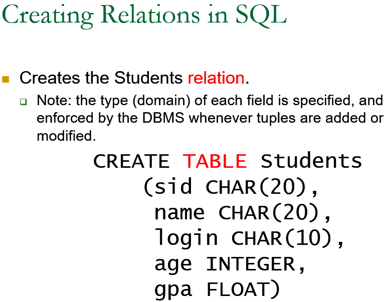

##DataBase Note
####介绍
- Data：
  - facts and statistics collected together for reference or analysis.

- A Database: Data + Base
  - A very large, structured collection of data.
  - Models some real-world “organization”, such as a university

- A Database Management System (`DBMS`) is: A software system designed to `store`, `manage`, and facilitate `query` to databases.

- Database System = Databases + DBMS

- “Search” vs. “Query”
  - Search is structure-free.
  - Query is structure-aware.

- Referring to the C programming language

  ```cpp
  struct BOOK {
		char TITLE [256];
		char AUTHOR [256];
		float PRICE;
		int    YEAR;
  }
  ```

- In this course, we study database management systems that focus on processing **structured** data.

- Structured Query Language (SQL) 

######Describing Data: Data Models
- A data model (数据模型) is a collection of concepts for describing data.

- A schema (模式)is a description of a particular collection of data, using a given data model.

- The relational data model is the most widely used model today.
  - Main concept:  relation, basically a table with rows and columns.
  - Every relation has a schema, which describes the columns, or fields (their names, types, constraints, etc.).

- Definition of the Students Schema

  ```bash
  Students (sid: string, name: string, login: string, age: integer, gpa: real)
  ```


######Levels of Abstraction in a DBMS
- Many views describe how users see the data.
  - Personalized access of data.

- Conceptual schema defines logical structure
  - i.e., what relations to store. 

- Physical schema specifies physical structure.
  - How the “logical” relations are physically stored on external storage such as disk.

  

######Data Independence(数据独立性)
- Applications insulated from how data is structured and stored.

- Logical data independence:  Protection from changes in logical structure of data.

- Physical data independence:   Protection from changes in physical structure of data.


######Queries in a Relational DBMS
- Specified in a Non-Procedural way
  - Users only specify what data they need;
  - A DBMS takes care to evaluate queries as efficiently as possible.

- a Non-Procedural Query Language: 
  - SQL: Structured Query Language
  - Basic form of a SQL query:

    ```bash
	SELECT  	target-list
	FROM         relation-list
	WHERE        	qualification
	```

######Concurrent execution of user programs
- Utilize CPU while waiting for disk I/O
  - (database programs make heavy use of disk)

- Avoid short programs waiting behind long ones
  - e.g. ATM withdrawal while bank manager sums balance across all accounts

- Concurrency Control(并发控制)
  - DBMS ensures such problems don’t arise.
  - Users can pretend they are using a single-user system.

######Incomplete Transaction and System Crashes
- Incomplete transaction
  - Canceled by the transaction or DBMS
  - Aborted unexpectedly by system crash

- Idea: Keep a log (history) of all actions carried out by the DBMS while executing a set of transactions:
  - Before a change is made to the database, the corresponding log entry is forced to a safe location.  (WAL (先写日志)protocol; OS support for this is often inadequate.)
  - After a crash, the effects of partially executed transactions are undone using the log.


####The Entity-Relationship Model
######Steps in Database Design
- Requirements Analysis
  - user needs; what must database do?

- Conceptual (Database) Design
 - high level (or semantic) description from users’ daily view.
 - often done with the ER model

- Logical (Database) Design
  - translate ER into DBMS data model (e.g., Relational Model)

- Schema Refinement(模式细化) 
  - consistency, normalization
  - Physical (Database) Design - indexes, disk layout
  - Security Design - who accesses what, and how

######ER Model Basics
- Entity(实体):
  - Real-world object distinguishable from other objects. 
  - An entity is described (in DB) using a set of attributes. 

- Entity Set(实体集):  A collection of similar entities.  
  - E.g., all employees.  
  - All entities in an entity set have the same attributes.
  - Each entity set has a ++key++ (underlined).
  - Each attribute has a domain


######Keys
- A key(键) is a minimal set of attributes whose values uniquely identify an entity in some entity set.
  - For each entity set, we choose a key.

- Candidate key(候选键)     
  - An entity set can have more than one key. 

- Primary key(主键)
  - We designate one of the candidate keys as the primary key.

######Representation of an Entity Set
- Entity set
  - Represented by a rectangle.

- Attribute:
  - Represented by an oval.

- Key:
  - Each attribute in the primary key is underlined.

  

- Relationship(联系):  Association among two or more entities.  

- Relationship Set (联系集) :  Collection of similar relationships.
  - An n-ary relationship set R relates n entity sets E1 ... En ; each relationship in R involves entities
  - Represented by a diamond.

- relationships can have their own attributes.

- A relationship must be uniquely identified by the participating entities, without reference to its own attributes.

  
  

- Same entity set can participate in different relationship sets, or in different “roles” in the same relationship set.

######Key Constraints(键约束)
- An employee can work in many departments; 
  - a dept can have many employees.

- In contrast, each dept has at most one manager, according to the key constraint on Manages.

  

######Participation Constraints(参与约束)
- The participation of the entity set Departments in the relationship set Manages is said to be total.(完全参与)
  - Connect Departments and Manages by a thick line.

- The participation of the entity set Employees in Manages is partial(部分参与).

  

######Weak Entities
- A weak entity can be identified uniquely only by relationship with of another (owner) entity.
  - Owner entity set and weak entity set must participate in a 1-N relationship set (1 owner, N weak entities).
  - Weak entity set must have total participation in this identifying relationship set.  

- Weak entities have only a “partial key” (dashed underline)

  

######Class Hierarchies:Organizing Entities into ISA  (`is a’) Hierarchies
- Overlap constraints(交迭约束):  
  - Can Joe be an Hourly_Emps as well as a Contract_Emps entity?  (Allowed / disallowed)

- Covering constraints(覆盖约束):  
  - Does every Employees entity also have to be an Hourly_Emps or a Contract_Emps entity?(Yes / no) 

  


######Aggregation(聚合)
- As defined so far, a relationship set is an association between entity sets.

- Aggregation allows us to model a relationship set between entities and relationships.
  - i.e., treat a relationship set as an entity set   for purposes of participation in (other) relationships.

  


####The Relational Model
######Relational Database: Definitions
- Relational database: 
  - a set of relations. 

- Relation: made up of 2 parts:
  - Schema(关系模式) : specifies name of relation, plus name and type of each field ( or column,or attribute). 
    - E.g. Students(sid: string, name: string, login: string, age: integer, gpa: real) 
 - Instance (关系实例): a set of tuples( or records) , each has fields as schema.  
    - think of as a table with rows and columns
    - i.e., all rows are distinct 
- fields = arity (or degree) 度

- rows = cardinality   - 基

- Can think of a relation as a set of rows or tuples. 

  
  
  


######Foreign Keys vs. Referential Integrity(引用完整性)
- Foreign key: Set of fields in one relation that is used to `refer’ to a tuple in another relation.  
  - Must correspond to the primary key of the other relation.  
  - Like a `logical pointer’.

- If all foreign key constraints are enforced,  ++referential integrity++ is achieved (i.e., no dangling references.)

  

######Integrity Constraints (ICs)
- IC: condition that must be true for any instance of the database
  - e.g., domain constraints.
  - ICs are specified when schema is defined.
  - ICs are checked when relations are modified.

- A legal instance of a relation is one that satisfies all specified ICs.  
  - DBMS should not allow illegal instances.

- If the DBMS checks ICs, stored data is more faithful to real-world meaning.
  - Avoids data entry errors, too!


#####SQL


######Semantics of a Query
- A conceptual evaluation method for the previous query:
  1. do FROM clause: compute cross-product of Students and Enrolled
  2. do WHERE clause: Check conditions, discard tuples that fail
  3. do SELECT clause: Delete unwanted fields

- Remember, this is conceptual.  Actual evaluation will be much more efficient, but must produce the same answers.


####Storing Data:  Disks and Files
######Block diagram of a DBMS


######Disks
- DBMS stores information on disks.
  - Tapes are also used.

- Major implications for DBMS design!
  - READ: transfer data from disk to main memory (RAM).
  - WRITE: transfer data from RAM to disk.


- Both high-cost(高开销)
  - Can/should plan carefully!


######Buffer Management in a DBMS 缓冲区管理
- Data must be in RAM for DBMS to operate on it!

- BufMgr hides the fact that not all data is in RAM

- When a Page is Requested ...
  - Buffer pool information table contains:` <frame#, pageid, pin_count, dirty>`
  - If requested page is not in pool:
    - Choose a frame for replacement.Only “un-pinned” pages are candidates!
    - If frame “dirty”, write current page to disk
    - Read requested page into frame
  - Pin the page and return its address.

- Buffer Replacement Policy
  - Frame is chosen for replacement by a replacement policy(替换策略):
    - Least-recently-used (LRU), MRU, Clock, … 
  - Policy can have big impact on #I/O’s;
    - Depends on the access pattern.

- **Problem of LRU**
  - Problem: Sequential flooding  --连续扩散
    - LRU + repeated sequential scans.(多次顺序扫描)

- “Clock” Replacement Policy 时钟替换策略
  - An approximation of LRU
    - Has similar behavior but less overhead
  - Arrange frames into a cycle, store one reference bit per frame
    - Can think of this as the 2nd chance bit
  - When pin_count reduces to 0, turn on reference bit (ref bit).
  - When replacement necessary:

    ```bash
	do for each frame in cycle {
	  if (pin_count == 0 && ref bit is on)
	     turn off ref bit; // 2nd chance
	  else if (pin_count == 0 && ref bit is off)
	     choose this page for replacement;
	  } until a page is chosen;
	```

######Files of Records(记录文件)
- Blocks are the interface for I/O, but…
  - Higher levels of DBMS operate on records, and files of records.

- FILE: A collection of pages, each containing a collection of records. Must support:
  - insert/delete/modify record
  - fetch a particular record (specified using record id)
  - scan all records (possibly with some conditions on the records to be retrieved)

######Unordered (Heap) Files --堆文件
- Collection of records in no particular order.

- As file shrinks/grows, disk pages (de)allocated

- To support record level operations, we must:
  - keep track of the pages in a file
  - keep track of free space on pages
  - keep track of the records on a page

- There are many alternatives for keeping track of this.
  - We’ll consider two.

- Heap File Implemented as a List (页链表)


  - The header page(首页) id and Heap file name must be stored someplace.
    - Database “catalog”
  - Each page contains 2 `pointers’ plus data.

 - One disadvantage
   - Virtually all pages will be on the free list if records are of variable length, i.e., every page may have some free bytes if we like to keep each record in a single page.

- Heap File Using a Page Directory(页目录)


  - The directory is itself a collection of pages; each page can hold several entries.
  - The entry for a page(目录项) can include the number of free bytes on the page.   `<pointer,free_number>`
  - To **insert a record**, we can search the directory to determine which page has enough space to hold the record.


- Indexes (a sneak preview)
  - A Heap file allows us to retrieve records:
    - by specifying the rid (record id), or
    - by scanning all records sequentially
  - Sometimes, we want to retrieve records by specifying the values in one or more fields, e.g.,
    - Find all students in the “CS” department
    - Find all students with a gpa > 3

  - Indexes are file structures that enable us to answer such value-based queries efficiently.

######System Catalogs
- For each relation:
  - name, file location, file structure (e.g., Heap file)
  - attribute name and type, for each attribute
  - index name, for each index
  - integrity constraints

- For each index:
  - structure (e.g., B+ tree) and search key fields

- For each view:
  - view name and definition

- Plus statistics, authorization, buffer pool size, etc.

######Summary
- Disks provide cheap, non-volatile storage.
  - Better random access than tape, worse than RAM
  - Arrange data to minimize seek and rotation delays.
    - Depends on workload!

- Buffer manager brings pages into RAM.
  - Page pinned in RAM until released by requestor.
  - Dirty pages written to disk when frame replaced (sometime after requestor unpins the page).
  - Choice of frame to replace based on replacement policy.
  - Tries to pre-fetch several pages at a time.

- DBMS vs. OS File Support
  - DBMS needs non-default features
  - Careful timing of writes, control over prefetch

- Variable length record format
  - Direct access to i’th field and null values.

- Slotted page format 
  - Variable length records and intra-page reorg

- DBMS “File” tracks collection of pages, records within each.
  - Pages with free space identified using linked list or directory structure

- Indexes support efficient retrieval of records based on the values in some fields.

- Catalog relations store information about relations, indexes and views.


####Overview of File Organizations and Indexing
- Big picture of overheads for data access – 数据访问开销
  - We’ll simplify things to get focused
  - Still, a bit of discipline:
    - Clearly identify assumptions 
    - Then estimate cost(估算开销) in a principled way

- Foundation for query optimization(查询优化)
  - Can’t choose the fastest scheme without an estimate of speed!

######Cost Model(代价模型) for Analysis
- B:  The number of data blocks
- R:  Number of records per block
- D:  (Average) time to read or write a disk block
- Average-case analyses for uniform random workloads
- We will ignore:
  - Sequential vs. Random I/O 
  - Pre-fetching
  - Any in-memory costs

######Indexes – 索引
- Allow record retrieval by value in one or more fields
  - Find all students in the “CS” department
  - Find all students with a gpa > 3

- Index : disk-based data structure for fast lookup by value
  - Search key(搜索键):  any subset of columns in the relation.
  - Search key need not be a key of the relation
    - Can have multiple items matching a lookup

- Index contains a collection of data entries (数据项)
  - Items associated with each search key value k -- k*
  - Data entries come in various forms, as we’ll see

- Clustered vs. Unclustered:
  - Cost of retrieving data records through index varies greatly based on whether index is clustered or not!

- Clustered index – 聚簇索引: 
  - order of data records the same as, or `close to’, order of index data entries
  - Alternative 1 implies clustered, but not vice-versa.

- Clustered vs. Unclustered Index
  - Alternative 2 data entries, data records in a Heap file.
    - To build clustered index, first sort the Heap file
      - with some free space on each block for future inserts
    - Overflow blocks(溢出块) may be needed for inserts.
      - Thus, order of data records is `close to’, but not identical to, the sort order.

   

- Clustered Pros –优点
  - Efficient for range searches
  - Possible locality benefits
  - Disk scheduling, prefetching, etc.

- Clustered Cons-缺点
  - More expensive to maintain 
    - on the fly or “sloppily” via reorganizations
    - Heap file usually only packed to 2/3 to accommodate inserts

   

######Summary
- Many alternative file organizations exist, each appropriate in some situation.

- If selection queries are frequent, sorting the file or building an index is important.
  - Hash-based indexes only good for equality search.
  - Sorted files and tree-based indexes best for range search; also good for equality search.  (Files rarely kept sorted in practice; B+ tree index is better.)

- Index is a collection of data entries plus a way to quickly find entries with given key values.

- Data entries in index can be one of 3 alternatives: (1) actual data records, (2)` <key, rid> `pairs, or (3) `<key, rid-list>` pairs.
  - Choice orthogonal to indexing structure (i.e., tree, hash, etc.).

- Usually have several indexes on a given file of data records, each with a different search key.

- Indexes can be classified as clustered vs. unclustered
  - Differences have important consequences for utility/performance.


####Relational Algebra
- Query languages:  manipulation and retrieval of data
- Query Languages != programming languages!
  - QLs not expected to be “Turing complete”.
  - QLs not intended to be used for complex calculations.
  - QLs support easy, efficient access to large data sets.
- Relational model supports simple, powerful QLs:
  - Strong formal foundation based on logic.
  - Allows for much optimization.

######Formal Relational Query Languages
- Relational Algebra(关系代数):  More operational, very useful for representing execution plans.

- Relational Calculus(关系演算):   Describe what you want, rather than how to compute it.  (Non-procedural, declarative.)


######Compound Operator: Join-连接


####Relational Calculus


####SQL:  The Query Language


######Join


