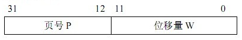

##OS Note
#####进程与线程的区别：
- 术语：
  - 进程（process）：程序的一次执行
  - 线程（thread）：是操作系统能够进行运算调度的最小单位

- 调度
  - 线程是CPU调度和分配的基本调度单位
  - 进程是作为资源拥有的基本单位

- 并发性
  - 引入线程的操作系统，不仅进程之间可以并发执行，而且在一个进程中的多个线程之间也可以并发执行

- 系统开销
  - 一般来说，线程自己不拥有系统资源，但可以访问其隶属进程的资源。亦即一个进程的代码片段、数据段、系统资源（如已打开的文件、I/O设备等） ，可供同一进程的其他所有线程共享。

- 拥有资源
  - 进程开销大，创建或撤销进程时，系统都要为之分配或回收资源，还有进程切换等。
  - 线程的切换、同步和通信都无需操作系统内核的干预。

- 操作系统的设计，因此可以归结为三点：
  - 以多进程形式，允许多个任务同时运行；
  - 以多线程形式，允许单个任务分成不同的部分运行；
  - 提供协调机制，一方面防止进程之间和线程之间产生冲突，另一方面允许进程之间和线程之间共享资源。

######死锁（deadlocks）
- `死锁`：是指两个或两个以上的进程在执行过程中,因争夺资源而造成的一种互相等待的现象,若无外力作用,它们都将无法推进下去.此时称系统处于死锁状态或系统产生了死锁,这些永远在互相等竺的进程称为死锁进程.

- 产生死锁的原因主要是:
  - 因为系统资源不足。
  - 进程运行推进的顺序不合适。
  - 资源分配不当等。

- 产生死锁的四个必要条件：
  - 互斥条件：一个资源每次只能被一个进程使用。
  - 请求与保持条件：一个进程因请求资源而阻塞时，对已获得的资源保持不放。
  - 不剥夺条件:进程已获得的资源，在末使用完之前，不能强行剥夺。
  - 循环等待条件:若干进程之间形成一种头尾相接的循环等待资源关系。

- 这四个条件是死锁的必要条件，只要系统发生死锁，这些条件必然成立，而只要上述条件之一不满足，就不会发生死锁。

######进程的的几种状态

- 就绪(Ready)状态
  - 当进程已分配到除CPU以外的所有必要资源后，只要再获得CPU，便可立即执行，进程这时的状态称为就绪状态。在一个系统中处于就绪状态的进程可能有多个，通常将它们排成一个队列，称为就绪队列。

- 执行状态
  - 进程已获得CPU，其程序正在执行。在单处理机系统中，只有一个进程处于执行状态； 在多处理机系统中，则有多个进程处于执行状态。

- 阻塞状态
  - 正在执行的进程由于发生某事件而暂时无法继续执行时，便放弃处理机而处于暂停状态，亦即进程的执行受到阻塞，把这种暂停状态称为阻塞状态，有时也称为等待状态或封锁状态。致使进程阻塞的典型事件有：请求I/O，申请缓冲空间等。通常将这种处于阻塞状态的进程也排成一个队列。有的系统则根据阻塞原因的不同而把处于阻塞状态的进程排成多个队列。

######IPC: 进程间通信(Internet Process Connection)
- linux下进程间通信的几种主要手段简介：
  - 管道（Pipe）及有名管道（named pipe）：管道可用于具有亲缘关系进程间的通信，有名管道克服了管道没有名字的限制，因此，除具有管道所具有的功能外，它还允许无亲缘关系进程间的通信；
  - 信号（Signal）：信号是比较复杂的通信方式，用于通知接受进程有某种事件发生，除了用于进程间通信外，进程还可以发送信号给进程本身；linux除了支持Unix早期信号语义函数sigal外，还支持语义符合Posix.1标准的信号函数sigaction（实际上，该函数是基于BSD的，BSD为了实现可靠信号机制，又能够统一对外接口，用sigaction函数重新实现了signal函数）；
  - 信号（Signal）：信号是比较复杂的通信方式，用于通知接受进程有某种事件发生，除了用于进程间通信外，进程还可以发送信号给进程本身；linux除了支持Unix早期信号语义函数sigal外，还支持语义符合Posix.1标准的信号函数sigaction（实际上，该函数是基于BSD的，BSD为了实现可靠信号机制，又能够统一对外接口，用sigaction函数重新实现了signal函数）；
  - 共享内存：使得多个进程可以访问同一块内存空间，是最快的可用IPC形式。是针对其他通信机制运行效率较低而设计的。往往与其它通信机制，如信号量结合使用，来达到进程间的同步及互斥。
  - 信号量（semaphore）：主要作为进程间以及同一进程不同线程之间的同步手段。
  - 套接口（Socket）：更为一般的进程间通信机制，可用于不同机器之间的进程间通信。起初是由Unix系统的BSD分支开发出来的，但现在一般可以移植到其它类Unix系统上：Linux和System V的变种都支持套接字。

######虚拟内存
- 虚拟内存是计算机系统内存管理的一种技术。它使得应用程序认为它拥有连续的可用的内存（一个连续完整的地址空间），而实际上，它通常是被分隔成多个物理内存碎片，还有部分暂时存储在外部磁盘存储器上，在需要时进行数据交换。与没有使用虚拟内存技术的系统相比，使用这种技术的系统使得大型程序的编写变得更容易，对真正的物理内存（例如RAM）的使用也更有效率。

######内存管理
- 逻辑地址（Logical Address）
  - 是指由程序产生的与段相关的偏移地址部分。例如，你在进行C语言指针编程中，可以读取指针变量本身值(&操作)，实际上这个值就是逻辑地址，它是相对于你当前进程数据段的地址，不和绝对物理地址相干。只有在Intel实模式下，逻辑地址才和物理地址相等（因为实模式没有分段或分页机制,Cpu不进行自动地址转换）；逻辑也就是在Intel 保护模式下程序执行代码段限长内的偏移地址（假定代码段、数据段如果完全一样）。应用程序员仅需与逻辑地址打交道，而分段和分页机制对您来说是完全透明的，仅由系统编程人员涉及。应用程序员虽然自己可以直接操作内存，那也只能在操作系统给你分配的内存段操作。

- 线性地址（Linear Address）
  - 是逻辑地址到物理地址变换之间的中间层。程序代码会产生逻辑地址，或者说是段中的偏移地址，加上相应段的基地址就生成了一个线性地址。如果启用了分页机制，那么线性地址可以再经变换以产生一个物理地址。若没有启用分页机制，那么线性地址直接就是物理地址。Intel 80386的线性地址空间容量为4G（2的32次方即32根地址总线寻址）。

- 物理地址（Physical Address）
  - 是指出现在CPU外部地址总线上的寻址物理内存的地址信号，是地址变换的最终结果地址。如果启用了分页机制，那么线性地址会使用页目录和页表中的项变换成物理地址。如果没有启用分页机制，那么线性地址就直接成为物理地址了。

- 虚拟内存（Virtual Memory）
  - 是指计算机呈现出要比实际拥有的内存大得多的内存量。因此它允许程序员编制并运行比实际系统拥有的内存大得多的程序。这使得许多大型项目也能够在具有有限内存资源的系统上实现。一个很恰当的比喻是：你不需要很长的轨道就可以让一列火车从上海开到北京。你只需要足够长的铁轨（比如说3公里）就可以完成这个任务。采取的方法是把后面的铁轨立刻铺到火车的前面，只要你的操作足够快并能满足要求，列车就能象在一条完整的轨道上运行。这也就是虚拟内存管理需要完成的任务。在Linux 0.11内核中，给每个程序（进程）都划分了总容量为64MB的虚拟内存空间。因此程序的逻辑地址范围是0x0000000到0x4000000。

- 虚拟地址到物理地址的转化方法是与体系结构相关的。一般来说有分段、分页两种方式。以现在的x86 cpu为例，分段分页都是支持的。Memory Mangement Unit负责从虚拟地址到物理地址的转化。逻辑地址是段标识+段内偏移量的形式，MMU通过查询段表，可以把逻辑地址转化为线性地址。如果cpu没有开启分页功能，那么线性地址就是物理地址；如果cpu开启了分页功能，MMU还需要查询页表来将线性地址转化为物理地址：
  - 逻辑地址 ----（段表）---> 线性地址 — （页表）—> 物理地址
  - 不同的逻辑地址可以映射到同一个线性地址上；不同的线性地址也可以映射到同一个物理地址上；所以是多对一的关系。另外，同一个线性地址，在发生换页以后，也可能被重新装载到另外一个物理地址上。所以这种多对一的映射关系也会随时间发生变化。

######页式和段式存储管理
- 页式存储管理
  - 将程序的逻辑地址空间划分为固定大小的页(page)，而物理内存划分为同样大小的页框(page frame)。程序加载时，可将任意一页放人内存中任意一个页框，这些页框不必连续，从而实现了离散分配。该方法需要CPU的硬件支持，来实现逻辑地址和物理地址之间的映射。在页式存储管理方式中地址结构由两部构成，前一部分是页号，后一部分为页内地址w（位移量）

    

 - 页式管理方式的优点是：
    - 没有外碎片，每个内碎片不超过页大比前面所讨论的几种管理方式的最大进步是，
    - 一个程序不必连续存放。
    - 便于改变程序占用空间的大小(主要指随着程序运行，动态生成的数据增多，所要求的地址空间相应增长)。

 - 缺点是：要求程序全部装入内存，没有足够的内存，程序就不能执行。

- 段式存储管理
  -  在段式存储管理中，将程序的地址空间划分为若干个段(segment)，这样每个进程有一个二维的地址空间。在前面所介绍的动态分区分配方式中，系统为整个进程分配一个连续的内存空间。而在段式存储管理系统中，则为每个段分配一个连续的分区，而进程中的各个段可以不连续地存放在内存的不同分区中。程序加载时，操作系统为所有段分配其所需内存，这些段不必连续，物理内存的管理采用动态分区的管理方法。

